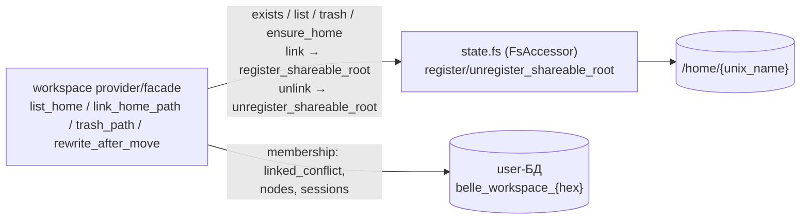

# ADR-002: Модуль mia-fs — диск пользователя, песочница и шаринг папок

| Поле | Значение |
|------|----------|
| **Статус** | accepted (решения утверждены Мастером 02.09.2026; schema review Норы внесено в ревизию 3; security review Литы внесено в ревизию 4 — до шага 5 плана; ревизия 5 — решения Мастера по шарингу: объект шаринга — только прилинкованные корни воркспейсов. Trash-PENDING закрыт. Открытым остаётся единственный вопрос: находка 1, unix_name — решение Мастера не принято, в ревизию не вносится) |
| **Дата** | 2026-09-02 (ревизия 5 — shareable roots, вердикты Мастера, вечер) |
| **Ревизия 3** | schema review Норы (02.09.2026): `created_by` → ON DELETE SET NULL (FK-блокер), `nodes_owner_path_idx` вместо одиночного owner, `acl_node_idx` вычеркнут, ленивая регистрация узла — один CTE-стейтмент |
| **Ревизия 4** | security review Литы (02.09.2026): находки 2 (ACL только на каноническом rel, §5.4), 3 (проверка каждого затрагиваемого пути, §4), 6 (приватностная цена Everyone + confirm, §5.5), 7 (rate-limit/квоты, §10), 11 (Trash-семантика — PENDING, §5.2/§5.4); фронт-требования — ADR-003 §9.3. **PENDING MASTER**: находка 1 (unix_name) и вердикт по находке 11 (Trash-семантика) ожидают решения Мастера *(пометка историческая: находка 11 закрыта в ревизии 5)* |
| **Ревизия 5** | решения Мастера (02.09.2026, вечер): **шаринг только линкованных корней** (§5.6) — объект шаринга только пути под прилинкованными корнями воркспейсов владельца, `rel=''` и пути вне линковок → `NOT_SHAREABLE`, грант на `''` не существует как класс; механизм реестра корней — колонка `is_shareable_root` в `fs.nodes` + внутренние методы `register/unregister_shareable_root` через разрешённую стрелку workspace→fs (§3, §5.6); гранты при отлинковке не отзываются (§5.6, решение по умолчанию); **Trash-PENDING (находка 11) закрыт**: грант на `''` упразднён → Trash недоступен получателям автоматически, отсекатель в машине §5.4 не нужен; тесты Катерины — кейсы `NOT_SHAREABLE` (§17) |
| **Авторы** | Эна (architect) |
| **Проекты** | mia-fs (новый репо → `mia/modules/fs`), mia-workspace, mia-worker, belle, albedo |
| **Связанные** | `albedo/plan-admin.md` (фаза 2, инварианты §2, приёмка §7); belle ADR-003 (named pools, user-БД), ADR-004 (apply один раз под lock); albedo ADR-001 (транспорт, cookies); **albedo ADR-003 (notification — уведомления о share_add)**; гранулы: переименование homes→fs, инвариант «FS только через state.fs» |
| **Стандарты** | `docs/CODING_STANDARD.md`, `docs/LOGGING_STANDARD.md`, `docs/OBSERVABILITY_STANDARD.md` |
| **Код не в этом ADR** | Сона не трогает репы до accepted Мастером |

---

## Решение (одна строка)

FS-домен выносится из workspace в отдельный модуль `mia/modules/fs`: чистая файловая логика (fs.py, homes.py, gitinfo.py) переезжает целиком, workspace оставляет себе только membership/сессии и зовёт диск через `state.fs`; все fs-RPC исполняются на Celery-воркере (`type="io"`) в песочнице `/home/{unix_name}`; шаринг — **identity-based ACL**: реестр узлов `fs.nodes` (стабильный uuid на расшаренный путь) + гранты `fs.acl` по `node_uuid`, с уровнями viewer/editor, наследованием вниз по path-prefix и batch-резолвом сущностей (resolved/unresolved/ambiguous) для AD-подобного поиска.

**Вердикты Мастера (02.09.2026), встроенные в эту ревизию:**

1. Уровни `viewer`/`editor` — утверждены.
2. **ACL управляет только владелец; админов без обхода.** Ни одна роль — включая `system_admin` и bootstrap-админа — не даёт доступ к чужим нерасшаренным папкам. Админ управляет людьми, не файлами. Право `fs:manage` отклонено окончательно.
3. Шаринг «всем» — через существующую builtin-группу **`Everyone`** (фактическое имя из кода auth, см. §5.5).
4. Disabled-получатель — грант разрешён; в API — флаг `active`, в UI — иконка отключённого пользователя.
5. **Identity-based ACL вместо path-based**: `fs.nodes` (uuid, path, deleted_at) + `fs.acl.node_uuid`. Rename/move не ломает доступ; trash «прячет» узел у получателей; восстановление оживляет.
6. Повторный `share_add` — идемпотентен: существующие гранты игнорируются (`skipped[]`), новые добавляются (`added[]`); уведомления — только по `added[]` (ADR-003).
7. `resolve_entities` — три статуса: `resolved | unresolved | ambiguous` с candidates-списком.
8. Кириллица в именах — подтверждена.

**Вердикты Мастера, ревизия 5 (02.09.2026, вечер):**

9. **Шаринг только линкованных корней.** Объект шаринга — ТОЛЬКО пути под прилинкованными корнями воркспейсов владельца (включая сам корень линковки; вложенные папки прилинкованного корня — можно). Шаринг `rel=''` (весь home) и любых путей вне линковок — запрещён, доменная ошибка **`NOT_SHAREABLE`**. Грант на `''` не существует как класс.
10. Реестр корней — **колонка `is_shareable_root` в `fs.nodes`** (не отдельная таблица): узел и так регистрируется лениво, флаг живёт с узлом, проверка `share_add` без лишнего JOIN (§5.6).
11. **Trash-семантика (находка 11, ревизия 4) — закрыта.** С упразднением гранта на `''` Trash недоступен получателям автоматически: отсекатель `NOT LIKE 'Trash/%'` в машине §5.4 не вводится. Единственный путь Trash к получателю — владелец сам слинковал Trash-подпуть в воркспейс и сам расшарил (осознанное действие, машина ACL работает как для любого пути).

---

## 1. Контекст и мотивация

Что сейчас смешано в `mia/modules/workspace` (факты из кода, 2026-09-02):

| Файл | Что живёт | Домен |
|------|-----------|-------|
| `fs.py` | `safe_name`, `join_rel`, `mkdir`, `touch`, `remove`, `trash_move`, `folder_stats`, `dir_child_count`, `move_into`, `rename_path`, `ensure_dir` | чистая FS |
| `homes.py` | `unix_name`, `ensure_unix_home`, `own_path`, `ensure_nested`, `list_home` | чистая FS |
| `gitinfo.py` | `list_repos` + приватные `_find_git/_run/_describe/_github_url` | чистая FS (git overlay) |
| `facade.py` | `UserStore`, `WorkspaceCatalog`, `WorkspaceAccessor`, `UserWorkspaces`, `Workspace`, `linked_conflict` | workspace-домен, но прямыми руками зовёт `ensure_dir/join_rel/mkdir/touch/remove/folder_stats/trash_move` |
| `provider.py` | RPC: workspace/session/nodes — домен; `ensure_home`, `list_home`, `create_home_path`, `home_stat`, `move_home_path`, `rename_home_path`, `trash_home_path`, `list_git` — диск | гибрид |
| `config.py` | `home_root` | FS-настройка в workspace-конфиге |

Следствия слияния:

1. Workspace владеет unix home, хотя его зона — проект (membership, сессии, ноды). Инвариант плана: «Workspace — проект. Диск — не его зона».
2. Все RPC workspace объявлены `type="database"`, включая чисто дисковые (`list_home`, `create_home_path`) — диспетчеризация воркера врёт о природе задачи.
3. Агентные тулы (фаза 7) обязаны идти через `fs.*` без зависимости от workspace — сегодня объекта домена «диск» не существует, есть только `state.workspace`.
4. `provider._home()` дёргает приватное `self._accessor._config.home_root` и вызывает `ensure_unix_home` на каждый RPC — провижининг home размазан по чужому провайдеру.
5. Шаринга нет вовсе: пользователь видит только свой `~/`, отдать папку коллеге нельзя.

План волны (фаза 2) предписывает: новый модуль `mia/modules/fs`, workspace перестаёт владеть unix home / list / mkdir / move / trash / git; `ensure_unix_home` уезжает в fs; workspace `link_home_path` зовёт fs только для проверки существования пути. Плюс требование Мастера добавить в фазу 2 шаринг папок/проектов между пользователями и группами.

---

## 2. Границы модуля fs

### 2.1. Переезжает в `mia/modules/fs` (целиком)

| Источник (workspace) | Судьба в fs |
|----------------------|-------------|
| `fs.py` — все 11 публичных функций + `FsError` | `fs/paths.py` (без изменений логики; `FsError` → `fs/errors.py`) |
| `homes.py` — `unix_name`, `ensure_unix_home`, `own_path`, `ensure_nested`, `list_home` | `fs/homes.py` |
| `gitinfo.py` — `list_repos` | `fs/gitinfo.py` |
| `config.home_root` | `FsConfig.home_root` (`FS_HOME_ROOT`, default `/home`) |
| RPC из `provider.py`: `ensure_home`, `create_home_path`, `home_stat`, `list_git` | fs-RPC `fs.ensure_home`, `fs.mkdir`+`fs.touch` (см. §4), `fs.stat`, `fs.git_status` |
| RPC-части: `list_home` (листинг), `move_home_path` (перемещение), `rename_home_path` (переименование), `trash_home_path` (перенос в Trash), `refresh_home` (пересчёт размеров) | fs-RPC `fs.list`, `fs.move`, `fs.rename`, `fs.trash`, `fs.stat`; workspace-обвязка остаётся в workspace (§2.2) |
| `ensure_dir`, `join_rel`, `mkdir`, `touch`, `remove`, `safe_name`, `folder_stats`, `trash_move` как инструменты `facade.py` | вызовы через `state.fs`, прямых импортов из `modules.fs` в workspace нет |

### 2.2. Остаётся в workspace

| Что | Почему |
|-----|--------|
| `UserStore`, `WorkspaceCatalog`, `WorkspaceAccessor`, `UserWorkspaces`, `Workspace` | user-БД, провижининг, агрегат workspace (belle ADR-003/004 не трогаем) |
| `linked_conflict` / `raise_linked_conflict` (`ALREADY_LINKED/ALREADY_NESTED/CONTAINS_LINKED`) | membership-логика |
| RPC: `list_workspaces`, `create_workspace`, `delete_workspace`, `get_workspace`, `list_nodes`, `create_folder`, `create_file`, `delete_node`, `link_home_path`, `unlink_home_path`, `trash_node`, `exclude_home_path`, `include_home_path`, все session/message RPC | проект, сессии, дерево нод |
| Обвязка после дисковых операций: `rewrite_after_move` (переписывание путей нод после `fs.move`/`fs.rename`), отцепление нод после `fs.trash`, `linked/excluded`-покрытие в `list_home` | workspace знает своё дерево; fs про ноды не знает |
| `list_home`, `move_home_path`, `rename_home_path`, `trash_home_path` как RPC-имена | совместимость с существующим UI: workspace остаётся тонким фасадом над `state.fs` + обвязкой |

Правило зависимостей: **workspace → fs (одна стрелка), fs → workspace — никогда**. fs не знает о нодах, воркспейсах и user-БД.

---

## 3. state.fs — интерфейс на Application

По аналогии со `state.workspace` и `state.llm`. Модуль `FsModule(ModuleBase)` в `on_load` вешает accessor:

```python
state.fs = FsAccessor(config, log, database)
```

`FsAccessor` — фасад уровня Application (публичный контракт модуля):

```python
class FsAccessor:
    # Провижининг
    def ensure_home(user: str) -> dict            # {home, unix_name}; useradd + mkdir + chown
    def home_for(user: str) -> str                # резолв пути без создания (валидация unix_name)

    # Диск (все rel — относительно home, валидация песочницы внутри)
    def exists(user: str, rel: str) -> bool       # для workspace.link_home_path
    def resolve(user: str, rel: str) -> Path      # canonical + проверка песочницы
    def list(user: str, rel: str, *, include_hidden: bool, include_size: bool) -> list[dict]
    def stat(user: str, rel: str) -> dict         # {rel_path, kind, child_count|size}
    def ensure_nested(user: str, rel: str, kind: str) -> dict   # folder|file + own_path
    def read(user: str, rel: str) -> dict         # {content_b64, size}
    def write(user: str, rel: str, content_b64: str) -> dict
    def move(user: str, src: str, dest_dir: str) -> str   # новый rel
    def rename(user: str, src: str, new_name: str) -> str # новый rel
    def trash(user: str, rel: str) -> str         # ~/Trash/belle/{utc}/{rel}
    def remove_outside_home(path: Path) -> None   # для workspace.delete_workspace
    def git_repos(user: str, rel_paths: list[str]) -> list[dict]

    # Статистика (для refresh_home-фасада workspace)
    def folder_stats(path: Path) -> tuple[int, int]

    # Shareable roots (ревизия 5) — ВНУТРЕННИЕ методы для workspace,
    # НЕ api=True RPC; контракт §5.6
    def register_shareable_root(user: str, rel: str) -> dict
      # exists-проверка + ленивая регистрация узла c is_shareable_root=TRUE
      # → {node_uuid, path, already_registered: bool}; путь не существует → NOT_FOUND
    def unregister_shareable_root(user: str, rel: str) -> dict
      # флаг снимается (идемпотентный no-op, если узла/флага нет);
      # гранты НЕ отзываются (политика §5.6) → {node_uuid, unmarked: bool}
```

- **Домен fs — один пользователь-владелец за вызов.** Первый аргумент `user` — uid (uuid) или username; accessor нормализует через `auth` и `unix_name`. Никаких «путей вне песочницы» через state.fs — инвариант плана (§2: «имя fs, но скоуп — домашние каталоги»).
- `workspace.link_home_path` = `state.fs.register_shareable_root(uid, rel)` (fs) + `ws.link_path` (membership). fs подтверждает существование пути И регистрирует shareable-корень одним вызовом (ревизия 5; до ревизии 5 здесь планировался чистый `exists` — проверка существования не потеряна, она внутри `register_shareable_root`). Стрелка workspace→fs сохраняется: проверка кода (`mia/modules/workspace/provider.py:330` → `facade.link_path`, где сейчас прямые `join_rel`/`exists` из workspace/fs.py) подтверждает — точка встраивания одна, `facade.link_path` остаётся membership-логикой, диск проверяет fs.
- `workspace.unlink_home_path` = `state.fs.unregister_shareable_root(uid, rel)` + `ws.unlink_path` (membership). Судьба грантов — политика §5.6 (не отзываются).
- `workspace.delete_workspace`: если root вне `home_root` — `state.fs.remove_outside_home`; внутри — диск не трогаем (сегодняшнее поведение сохранено).

### 3.1. Как workspace использует state.fs (тонкий фасад)

```
provider.list_home(...)      = state.fs.list(...)          + linked/excluded cover
provider.create_home_path    = state.fs.ensure_nested(...)
provider.move_home_path      = state.fs.move(...)          + ws.rewrite_after_move(...)
provider.rename_home_path    = state.fs.rename(...)        + ws.rewrite_after_move(...)
provider.trash_home_path     = state.fs.trash(...)         + ws._unlink_prefix(...)
provider.refresh_home        = state.fs.folder_stats(...)  + ws.touch_folder_stats(...)
provider.list_git            = state.fs.git_repos(...)
provider.ensure_home         = state.fs.ensure_home(...)
provider.link_home_path      = state.fs.register_shareable_root(...)  + ws.link_path(...)
provider.unlink_home_path    = state.fs.unregister_shareable_root(...) + ws.unlink_path(...)
provider._home(uid)          = state.fs.ensure_home(uid)   # провижининг больше не в workspace
```

У workspace исчезают импорты `from .fs import ...` и `from .homes import ...` — файлы `fs.py`/`homes.py`/`gitinfo.py` физически удаляются из репозитория workspace.

---

## 4. RPC-поверхность fs.*

Транспорт: `POST /api/v1/fs/{method}`, envelope `{data, error, meta}`, HttpOnly cookies, `X-Albedo-Client: spa` (albedo ADR-001). Тип задач — **`type="io"`**: в `core/task.py` `TaskType` = `{io, cpu, gpu, network, database, aggregate, unknown}` — значения `file` **не существует**, диск это I/O. Permission через `@task(api=True, permission=...)` → required_permission в `_api_meta`.

| RPC `fs.*` | type | permission | timeout | Назначение |
|------------|------|-----------|---------|------------|
| `ensure_home()` | io | `fs:read` | 10 | создать unix-юзера и `~/` если нет → `{home, unix_name}` |
| `list(rel_path="", owner?=, include_hidden=false, include_size=false)` | io | `fs:read` | 10 | листинг каталога (своего или расшаренного, §6) |
| `stat(rel_path, owner?=)` | io | `fs:read` | 5 | kind + child_count/size |
| `read(rel_path, owner?=)` | io | `fs:read` | 30 | содержимое файла, b64, лимит `FS_MAX_WRITE_BYTES` |
| `write(rel_path, content_b64, owner?=)` | io | `fs:write` | 30 | запись/перезапись файла |
| `mkdir(rel_path, owner?=)` | io | `fs:write` | 10 | создать папку (ensure_nested kind=folder) |
| `touch(rel_path, owner?=)` | io | `fs:write` | 10 | создать файл (ensure_nested kind=file) |
| `move(src, dest_dir, owner?=)` | io | `fs:write` | 30 | перемещение внутри home + обновление `fs.nodes.path` (§5.2) |
| `rename(src, new_name, owner?=)` | io | `fs:write` | 30 | переименование + обновление `fs.nodes.path`/`display_name` (§5.2) |
| `trash(rel_path, owner?=)` | io | `fs:write` | 30 | в `~/Trash/belle/{utc}/{rel}` + `fs.nodes.deleted_at` (§5.2) |
| `git_status(rel_paths[])` | io | `fs:read` | 15 | git overlay (перенос `list_git`) — только свои репо |
| `list_shared()` | io | `fs:read` | 10 | корни, расшаренные на меня — из `fs.nodes` × `fs.acl` (§5.3) |
| `share_list(path)` | io | `fs:share` | 10 | ACL-таблица пути (только владелец) |
| `share_add(path, grantees[], level)` | io | `fs:share` | 10 | выдать доступ; идемпотентно → `added[]/skipped[]` + уведомления (§8.1, ADR-003) |
| `share_remove(path, grantee_type, grantee_id)` | io | `fs:share` | 10 | отозвать доступ |
| `resolve_entities(inputs[])` | io | `fs:share` | 10 | batch-проверка существования (§8.2) |

Принципы:

- **Каждая дисковая операция = одна ACL-проверка на КАЖДЫЙ ЗАТРАГИВАЕМЫЙ ПУТЬ** (security review Литы, находка 2, критично; ревизия 4). Формулировка «одна проверка на RPC» из ревизии 3 снята как небезопасная: у операции может быть несколько путей, и каждый обязан пройти машину §5.4 независимо:
  - `move(src, dest_dir)`: проверяются **ОБА** пути — `src` и `dest_dir`; оба ≥ требуемого уровня (`write` = editor). Одной проверки недостаточно: грант на `src` не даёт права размещать содержимое в `dest_dir`, и наоборот.
  - `rename(src, new_name)`: проверяется `src` — `dest` находится в том же каталоге (новое имя не меняет каталог), отдельной проверки не требует.
  - `trash(rel_path)`: проверяется `rel` — destination (`~/Trash/belle/{utc}/{rel}`) создаётся воркером в своей песочнице и проверке получателем не подлежит.
  Никакой композиции «диск + БД workspace» в fs — для этого есть фасад workspace.
- `owner?` опущен → своя песочница; задан → машина проверки ACL (§5.4). В `owner` принимается username или uuid; в ответах отдаются оба (вердикт §20.11).
- SQL только на воркере: ACL-lookup и resolve выполняются в теле fs-задач на воркере (`type="io"`), belle только диспатчит — требование Мастера соблюдено.
- Permission-модель: `fs:read` на чтение, `fs:write` на мутацию диска, `fs:share` на управление доступом (§7).
- **Проверку ACL и проверку владения для share_* проходит только владелец** (§7): ни одна роль не даёт управления чужими ACL.

---

## 5. Модель шаринга: identity-based ACL

### 5.0. Реестр узлов `fs.nodes` (системная БД belle, схема `fs`)

Мастер (правка №5, 02.09.2026): **ACL ссылается на узел (uuid), а не на путь**. Путь — изменяемое представление; uuid — стабильная identity расшаренного объекта.

```sql
CREATE TABLE IF NOT EXISTS fs.nodes (
    node_uuid          UUID PRIMARY KEY DEFAULT gen_random_uuid(),
    owner_user_id      UUID NOT NULL REFERENCES auth.users(id) ON DELETE CASCADE,
    path               TEXT NOT NULL,               -- относительный путь от ~ владельца
    node_type          VARCHAR(4) NOT NULL CHECK (node_type IN ('dir', 'file')),
    display_name       TEXT NOT NULL,               -- basename(path); переименование обновляет
    is_shareable_root  BOOLEAN NOT NULL DEFAULT FALSE,  -- ревизия 5: узел = корень линковки workspace
    created_at         TIMESTAMPTZ NOT NULL DEFAULT NOW(),
    updated_at         TIMESTAMPTZ NOT NULL DEFAULT NOW(),
    deleted_at         TIMESTAMPTZ                  -- NOT NULL = живой; заполнено = «удалён» (trash)
);
-- один живой узел на путь владельца (ленивая регистрация идемпотентна)
CREATE UNIQUE INDEX IF NOT EXISTS nodes_owner_path_live_idx
    ON fs.nodes (owner_user_id, path) WHERE deleted_at IS NULL;
CREATE INDEX IF NOT EXISTS nodes_owner_path_idx ON fs.nodes (owner_user_id, path);
-- проверка share_add: живые корни линковки владельца (ревизия 5, §5.6)
CREATE INDEX IF NOT EXISTS nodes_shareable_roots_idx
    ON fs.nodes (owner_user_id, path) WHERE deleted_at IS NULL AND is_shareable_root;
```

> **Если `001_nodes.sql` уже накатан в среде** (шаг 1 плана выполнен до ревизии 5) — идемпотентная догонка: `ALTER TABLE fs.nodes ADD COLUMN IF NOT EXISTS is_shareable_root BOOLEAN NOT NULL DEFAULT FALSE;` + `CREATE INDEX IF NOT EXISTS nodes_shareable_roots_idx ...`. Свежие развёртывания получают колонку из `001_nodes.sql` сразу.

**Ленивая регистрация:** реестр заполняется не заранее, а в момент первой нужды — одним CTE (ревью Норы, 02.09.2026: не INSERT+SELECT двумя стейтментами; предикат `WHERE deleted_at IS NULL` в conflict_target обязателен — без него PG не найдёт арбитра частичного индекса). Ревизия 5 добавляет второй триггер регистрации: **`register_shareable_root` при `workspace.link_home_path`** — узел корня линковки создаётся сразу с `is_shareable_root = TRUE`; `share_add` по вложенному пути регистрирует узел с `FALSE` (флаг есть только у корней линковки — шарить вложенное разрешает prefix-матч от корня, §5.6):

```
WITH ins AS (
    INSERT INTO fs.nodes (owner_user_id, path, node_type, display_name, is_shareable_root)
    VALUES (:owner, :path, :type, basename(:path), :as_shareable_root)
    ON CONFLICT (owner_user_id, path) WHERE deleted_at IS NULL
    DO UPDATE SET is_shareable_root = fs.nodes.is_shareable_root OR :as_shareable_root,
                  updated_at = NOW()
    RETURNING node_uuid)
SELECT node_uuid FROM ins
UNION ALL
SELECT node_uuid FROM fs.nodes
WHERE owner_user_id = :owner AND path = :path AND deleted_at IS NULL
LIMIT 1;
```

(`DO UPDATE` делает вызов идемпотентным и повторной линковкой того же пути возвращает флаг в `TRUE` после отлинковки; `share_add` передаёт `as_shareable_root = FALSE` — UPDATE-ветка тогда не меняет флаг и остаётся чистым «подтверди узел».)

До первой линковки/шаринга строк нет — реестр не фонит; наличие папки на диске не требует записи в `fs.nodes`. `path = ''` в реестре **не возникает никогда**: `register_shareable_root` и `share_add` отвергают пустой rel доменной ошибкой `NOT_SHAREABLE` (§5.6).

**Инвариант источников истины:** диск — истина о существовании контента; `fs.nodes` — истина о том, «кто что расшаривал». Расхождение (реестр жив, папка стёрта внешним процессом) даёт честный `NOT_FOUND` на дисковой операции — гранты при этом не чистятся (см. §19, риск 8).

### 5.1. Таблица `fs.acl` — гранты по `node_uuid`

```sql
CREATE TABLE IF NOT EXISTS fs.acl (
    id               UUID PRIMARY KEY DEFAULT gen_random_uuid(),
    node_uuid        UUID NOT NULL REFERENCES fs.nodes(node_uuid) ON DELETE CASCADE,
    grantee_type     VARCHAR(8) NOT NULL CHECK (grantee_type IN ('user', 'group')),
    grantee_user_id  UUID REFERENCES auth.users(id) ON DELETE CASCADE,
    grantee_group_id UUID REFERENCES auth.groups(id) ON DELETE CASCADE,
    level            VARCHAR(8) NOT NULL CHECK (level IN ('viewer', 'editor')),
    created_by       UUID REFERENCES auth.users(id) ON DELETE SET NULL,
    created_at       TIMESTAMPTZ NOT NULL DEFAULT NOW(),
    updated_at       TIMESTAMPTZ NOT NULL DEFAULT NOW(),
    CONSTRAINT acl_grantee_exclusive CHECK (
        (grantee_user_id IS NULL) <> (grantee_group_id IS NULL)
    )
);
-- одна гранта на пару «узел+получатель» (COALESCE — только уникальным индексом:
-- CONSTRAINT UNIQUE в PostgreSQL не принимает выражения; в ревизии 1 это был дефект DDL)
CREATE UNIQUE INDEX IF NOT EXISTS acl_unique_grant_idx
    ON fs.acl (node_uuid, grantee_type, COALESCE(grantee_user_id, grantee_group_id));
CREATE INDEX IF NOT EXISTS acl_grantee_user_idx  ON fs.acl (grantee_user_id);
CREATE INDEX IF NOT EXISTS acl_grantee_group_idx ON fs.acl (grantee_group_id);
```

Замечания:

- `base_path` из ревизии 1 удалён: путь теперь атрибут узла (`fs.nodes.path`), грант ссылается на `node_uuid`. **Rename/move владельцем меняет `path`, но не трогает гранты.**
- Два nullable FK вместо полиморфного `grantee_id` — честная ссылочная целостность: удаление пользователя/группы каскадно удаляет гранты (вердикт §20.7 — принято).
- **Самогрант** (`grantee_user_id = владелец узла`) не выражается CHECK'ом (owner в другой таблице — подзапросы в CHECK запрещены в PG): проверяется в коде `share_add` (→ `skipped[]`).
- `ON CONFLICT DO NOTHING` в `share_add` требует уникального индекса выше — идемпотентность повторного вызова (вердикт §20.6).
- `acl_node_idx` вычеркнут (ревью Норы, 02.09.2026): leading-колонка `node_uuid` уникального индекса `acl_unique_grant_idx` уже покрывает lookup по узлу, `share_remove` и каскадный DELETE. `acl_grantee_user_idx` / `acl_grantee_group_idx` оставлены (обратный lookup «что мне расшарено»).
- Арбитраж повторных грантов в `share_add` обязан дословно повторять выражение уникального индекса: `ON CONFLICT (node_uuid, grantee_type, COALESCE(grantee_user_id, grantee_group_id)) DO NOTHING`.
- `created_by` — `ON DELETE SET NULL` (ревью Норы, ревизия 3; проверено в ревизии 4: DDL выше и текст замечаний совпадают): удаление автора гранта **не удаляет сам грант** — грант принадлежит паре «узел+получатель», а не автору; автор обнуляется. CASCADE здесь был бы дефектом: уход владельца-автора стирал бы доступ у живых получателей.

### 5.2. Жизненный цикл узла: rename / move / trash / restore

| Операция владельца | Диск | `fs.nodes` | Эффект у получателя |
|--------------------|------|-----------|---------------------|
| `fs.rename(src, new_name)` | переименование | узел живой и существует → `UPDATE path, display_name, updated_at` | **имя обновляется автоматически** (uuid стабилен) |
| `fs.move(src, dest_dir)` | перемещение | узел живой и существует → `UPDATE path, display_name, updated_at` | **место обновляется автоматически** |
| `fs.trash(rel_path)` | в `~/Trash/belle/{utc}/{rel}` | узел живой и существует → `UPDATE deleted_at = NOW()` | узел «пропадает»: resolve → NOT_FOUND, из `list_shared` исчезает (вердикт Мастера: «если удалил — пропадает») |
| восстановление из Trash (move владельцем из `Trash/...` на обычный путь) | перенос обратно | узел существует и `deleted_at IS NOT NULL` → `UPDATE deleted_at = NULL, path, display_name` | узел «оживает», получатель снова видит папку/файл |

Правила:

1. **Обновление реестра — только если узел уже существует** (ленивая модель: нет узла → нет грантов → нечего обновлять).
2. Гранты при trash **не удаляются** — они «спят» вместе с узлом; восстановление оживляет доступ без перевыдачи.
3. Дисковый путь в Trash не резолвится для получателя вдвойне: (а) `deleted_at` фильтрует узел, (б) путь `Trash/belle/{utc}/...` не матчится prefix-правилом гранта.
4. `fs.rename/move/trash` выполняют UPDATE реестра в той же воркерной задаче после успешной дисковой операции; ошибка UPDATE реестра → лог `fs_nodes_update_failed` (WARN) + метрика — диск не откатывается, рассинхронизация самотерапевтична следующей операцией владельца над тем же путём.
5. **Trash-семантика — ЗАКРЫТО решением Мастера (ревизия 5; была находка 11 Литы, ревизия 4).** Вердикт: **Trash недоступен получателям автоматически, отсекатель не нужен.** Раньше вопрос существовал из-за гранта на `''` (весь home), чей дизъюнкт `OR n.path = ''` в машине §5.4 протаскивал `Trash/`-пути. Ревизия 5 упраздняет грант на `''` как класс (§5.6) — вектор исчез вместе с ним: линковка воркспейса на `Trash/...` не происходит в обычном потоке, а линковка+шаринг Trash-подпути вручную — осознанное действие владельца, которое машина ACL обрабатывает как любой другой путь. Дизъюнкт `OR n.path = ''` удалён из шага 3a (мёртвая ветка несуществующего класса грантов).

### 5.3. Уровни доступа

| Уровень | read | write | Семантика |
|---------|------|-------|-----------|
| `viewer` | ✅ | ❌ | читать/листить/скачивать |
| `editor` | ✅ | ✅ | + писать, создавать, перемещать, переименовывать, в корзину |
| владелец (implicit) | ✅ | ✅ | полный доступ, в `fs.acl` не пишется (вердикт §20.2) |

Расширение набора уровней (commenter, uploader) — по потребности, миграция CHECK без изменения структуры.

### 5.4. Машина проверки доступа (гибрид identity + path-prefix)

Воркер, в теле каждого fs-RPC с `owner`:

> **Аксиома машины (security review Литы, находка 2, критично; ревизия 4):**
> **ACL-lookup выполняется ТОЛЬКО на каноническом rel, полученном из
> `resolved.relative_to(root).as_posix()`. Сырой rel от клиента в машину не попадает никогда.**
>
> Обоснование: строка `rel="shared/../secret"` проходит песочницу (`resolve()` канонизирует её в
> `secret` — внутри корня, отказ не срабатывает), но если в машину §5.4 шага 3a попала **сырая**
> строка, LIKE-префикс `shared/%` сматчится, и грант на папку `shared/` откроет доступ к
> `secret` — обход наследования через `..`. Канонизация убивает вектор: `relative_to(root)`
> выполняется до машины, и lookup видит только нормализованный путь без `..` и symlink'ов.
> Порядок обязателен: `join_rel` (песочница) → канонический rel → ACL-машина → диск.
>
> Дополнительно (находка 3, §4): машина вызывается на **каждый затрагиваемый путь** — для
> `move(src, dest_dir)` **дважды** (по `src` и по `dest_dir`); оба результата должны быть
> ≥ требуемого уровня. Аналогично trash/restore с двумя путями (src + путь в Trash) — см. §4.

```
1. requester_uid, owner_uid — резолв через auth (username | uuid)
2. requester_uid == owner_uid
      → OWNER: полный доступ, песочница своего home
3. Иначе — гибридная проверка (identity для стабильности, path-prefix для наследования):
   a) кандидаты-узлы владельца, являющиеся предками целевого пути P
      (узел на самом P тоже «предок» — точный матч):
        SELECT n.node_uuid, n.path
        FROM fs.nodes n
        WHERE n.owner_user_id = :owner_uid
          AND n.deleted_at IS NULL
          AND (:rel = n.path OR :rel LIKE n.path || '/%');
      -- (ревизия 5: дизъюнкт OR n.path = '' удалён — грант на '' не существует
      --  как класс, см. §5.6; ветка была бы мёртвым кодом)
   b) самый специфичный грант по uuid кандидатов:
        SELECT n.path, a.level
        FROM fs.acl a
        JOIN fs.nodes n ON n.node_uuid = a.node_uuid
        WHERE a.node_uuid IN ( :uuids_из_3a )
          AND ( a.grantee_user_id = :requester_uid
                OR a.grantee_group_id IN (
                     SELECT group_id FROM auth.user_group_membership
                      WHERE user_id = :requester_uid
                     UNION
                     SELECT id FROM auth.groups
                      WHERE name = 'Everyone' AND is_builtin ) )
        ORDER BY length(n.path) DESC
        LIMIT 1;
      → row: сверить level ≥ требуемого (write требует editor)
      → нет строки / уровень ниже → ForbiddenError("FS_ACCESS_DENIED") + security-событие (§10)
4. Целевой путь резолвится в песочнице ВЛАДЕЛЬЦА (/home/{unix_name(owner)});
   диска нет → NOT_FOUND — в т.ч. случай «грант есть, узел в trash» (deleted_at
   уже отсёк узел на шаге 3a)
```

> **Trash-семантика — закрыта (ревизия 5, бывшая находка 11).** Отсекатель
> `AND n.path NOT LIKE 'Trash/%'` НЕ вводится: Trash недоступен получателям
> автоматически, потому что гранта на `''` (единственного, кто матчил `Trash/...`
> через дизъюнкт) больше не существует как класс — §5.6. Детали — правило 5 §5.2.

**Почему гибрид, честно:**

- **identity (`node_uuid`) даёт стабильность**: переименовал/перенос владелец — гранты и имя у получателя целы (§5.2).
- **path-prefix даёт наследование вниз**: грант на папку-uuid покрывает всё поддерево, включая **созданные после шаринга** вложенные пути — их не существует в реестре, и префикс-матч по `path` родителя ловит их без регистрации каждого потомка. Альтернатива «материализовать узел на каждый потомок» отклонена: взрыв строк реестра и запись в БД на каждый `mkdir` владельца.
- Порядок специфичности — по длине `path` узла (как раньше по `base_path`): грант на вложенную папку `projects/x` перекрывает грант на корень линковки `projects` для её поддерева. *(Ревизия 5: прежний пример «перекрывает грант на `''`» снят — такого гранта больше не существует, §5.6.)*

Свойства машины:

- **Наиболее специфичный грант выигрывает** (самый длинный `path`).
- **Отзыв мгновенный**: кеша ACL нет — каждый RPC смотрит в БД. Один-два indexed lookup на запрос; кеш = задержка отзыва, недопустимо.
- Группы читаются через `auth.user_group_membership` (read-only JOIN) **плюс Everyone** (§5.5). Это единственное касание auth-таблиц помимо FK; запись в auth-схему из fs запрещена. Если позже появится batch-порт в AuthProvider — переходим на него.
- Nested-группы (`group_group_membership`) в v1 не разворачиваются — только прямое membership (расширение по иерархии — волна N+1).

### 5.5. Группа `Everyone` — фактическое имя из кода auth

Проверено по коду mia-auth (вердикт Мастера №3 — шаринг «всем» через существующую группу):

| Факт | Источник |
|------|----------|
| Имя группы — **`Everyone`** (латиницей, точно эта строка) | `auth/schema_registry.py::_seed_administrators_group`: `INSERT INTO auth.groups ... 'Everyone', 'All users of the system', is_builtin=TRUE` — сид при каждом `register_sync("auth", ...)` |
| Участие неявное: **ни один юзер не добавлен в Everyone явно** — рекурсивные CTE auth добавляют её UNION'ом: `UNION SELECT id FROM auth.groups WHERE name='Everyone' AND is_builtin` | `auth/repository.py::get_user_effective_roles / get_user_effective_permissions / get_permissions_version` |
| Явное добавление/удаление в Everyone **запрещено**: `raise ForbiddenError("Everyone already includes all users")` | `auth/provider.py` (add/remove user to group) |

Следствия для fs:

1. **SQL машины §5.4 обязан повторять семантику auth**: явные группы + Everyone через UNION. (В ревизии 1 SQL брал только явный membership — Everyone-грант не сработал бы; исправлено в этой ревизии.)
2. Грант `grantee_group_id = Everyone.id` = «всем пользователям системы», включая будущих; UI обязан помечать такой грант явно (вердикт §20.8: разрешить с явной пометкой).
3. Резолв Everyone в `resolve_entities` работает как обычная группа (по имени); `share_add(grantee_type=group, id=Everyone.id)` — валиден.
4. Уведомление при Everyone-гранте: **шлётся** — асинхронно, батчами через воркер `notification.distribute` (вердикт Мастера №4 от 02.09.2026, ADR-003 §6.1); `share_add` раздачу не ждёт.

**Приватностная цена Everyone (security review Литы, находка 6, средний приоритет; ревизия 4).** Грант `Everyone` = **публичное раскрытие** `actor_name` + `node_name` всем активным пользователям системы: каждый активный юзер получит уведомление «Пользователь {actor_name} предоставил вам доступ к папке/файлу {node_name}» (вердикт Мастера №4 ADR-003, §6.1 — уведомления шлём). Тот, кто шарит «всем», делится не только файлом, но и своим именем с каждым пользователем платформы — это не дефект, а свойство broadcast-гранта, о котором владелец обязан знать осознанно.

Фронт-компенсация — **confirm-диалог в Share-окне при выборе Everyone** (требование внесено в ADR-003 §9.3, п. 5). **Каноническая формулировка (фиксируется здесь, фронт использует дословно):**

> **«Папка станет доступна всем пользователям. Они увидят ваше имя и имя папки.»**

Диалог обязателен перед отправкой `share_add` с Everyone-грантом; отказ в confirm = этот получатель не добавляется (остальные выбранные grantees обрабатываются штатно).

### 5.6. Shareable roots — шаринг только прилинкованных корней (вердикт Мастера, ревизия 5)

**Норма.** Объект шаринга — ТОЛЬКО пути, лежащие под прилинкованными корнями воркспейсов владельца, **включая сам корень линковки** (шарить корень — можно; вложенные папки прилинкованного корня — можно). Шаринг всего остального — запрещён:

| Попытка | Результат |
|---------|-----------|
| `share_add(rel='')` — весь home | **`NOT_SHAREABLE`** немедленно, до всякого поиска по реестру |
| `share_add(rel)` — путь вне всех линковок владельца | **`NOT_SHAREABLE`** |
| `share_add(rel)` — путь внутри прилинкованного корня (в т.ч. созданный после линковки) | разрешён (prefix-матч от корня) |
| `share_add(rel == корень линковки)` | разрешён (точный матч) |

Ошибка доменная: `FS_NOT_SHAREABLE` в envelope (транспортный HTTP остаётся 200, albedo ADR-001), security-событие **не** генерируется — это не атака, а легитимный отказ валидации владельца.

**Почему норма именно такая.** Линковка в воркспейс — единственное место, где владелец осознанно объявляет «эта папка — часть моей публичной работы». Home целиком — свалка всего (черновики, Trash, служебное); расшарить его одной кнопкой — дыра в приватности (включая протечку в Trash — бывшая находка 11, §5.2). Превью шаринга в UI тоже честнее: Share-диалог открывается из дерева воркспейса, т.е. уже линкованного пути — пользователь физически не встретит кнопку, которая отвалится с `NOT_SHAREABLE`.

#### 5.6.1. Механизм реестра корней — колонка `is_shareable_root` в `fs.nodes`

**Выбрано: колонка в `fs.nodes`, не отдельная таблица `fs.shareable_roots`.**

| Критерий | Колонка в `fs.nodes` ✅ | Отдельная таблица ❌ |
|----------|------------------------|---------------------|
| Синхронизация с узлом | Флаг живёт и умирает с узлом: `deleted_at` (trash), `path` (rename/move) обслуживают корень тем же механизмом §5.2 — ноль нового кода | Вторая сущность с собственным `path`, который надо обновлять параллельно узлу; два источника истины об одном объекте |
| Проверка в `share_add` | Один запрос: `SELECT ... WHERE owner_user_id = :owner AND deleted_at IS NULL AND is_shareable_root` — prefix-матч по живым корням; частичный индекс `nodes_shareable_roots_idx` | Всегда JOIN `fs.shareable_roots × fs.nodes` — а узел всё равно нужен: гранты ссылаются на `node_uuid`, значит узел существует в обеих моделях |
| Поведение при отлинковке | `UPDATE is_shareable_root = FALSE` — узел с грантами остаётся жить (политика §5.6.3) | DELETE строки корня при живом узле-носителе грантов — расщепление: «корня нет, узел есть» выражается двумя таблицами вместо одного флага |
| Стоимость записи | `register_shareable_root` — тот же CTE §5.0 с `as_shareable_root = TRUE` | INSERT в дополнительную таблицу в той же транзакции |

Таблица `fs.shareable_roots` рассматривалась и отклонена окончательно (см. §18): единственный её выигрыш — «чистая» семантика узла, оплаченная JOIN'ом в горячей проверке `share_add`, дублированием жизненного цикла и расщеплением identity. Склонность Мастера (колонка, меньше JOIN, флаг живёт с узлом) подтверждена анализом.

**Инварианты флага:**

- `is_shareable_root = TRUE` имеет **только узел самого корня линковки**; узлы вложенных расшаренных папок несут `FALSE` — право шарить вложенное каждый раз заново доказывается prefix-матчем от живого корня, а не наследуется флагом. Следствие: отлинковка корня мгновенно закрывает `share_add` на всю его бывшую территорию, включая ранее расшаренные вложенные пути (гранты при этом живут, §5.6.3).
- Повторная линковка того же пути → CTE `DO UPDATE` возвращает флаг в `TRUE` — шаринг этой территории снова разрешается, идемпотентно.
- Trash → `deleted_at` → корень выпадает из проверки `share_add` (живых корней нет → `NOT_SHAREABLE`), restore возвращает. Отдельного правила не нужно — работает общий жизненный цикл узла §5.2.

#### 5.6.2. Контракты `register/unregister_shareable_root` (стрелка workspace → fs)

fs → workspace запрещена (§2.2), поэтому registry живёт в fs и **вызывается workspace'ом** через разрешённую стрелку — на уже существующей точке касания. Проверка кода (02.09.2026): `workspace.provider.link_home_path` (provider.py:322) зовёт `ws.link_path(rel, create_missing=False)`, а проверку существования выполняет `facade.link_path` (facade.py:588: `join_rel` + `path.exists()` — сегодня прямые руки workspace на диск через свои `fs.py`/`homes.py`). После переноса (шаги 3–6 плана §17) диск из этого места трогает только `state.fs` — `register_shareable_root` встраивается ровно туда, где планировался `exists`, **одна стрелка сохраняется**:

```
provider.link_home_path   = state.fs.register_shareable_root(uid, rel)   # fs: exists + узел c флагом
                          + ws.link_path(rel, create_missing=False)      # membership, без диска
provider.unlink_home_path = state.fs.unregister_shareable_root(uid, rel) # fs: флаг снять
                          + ws.unlink_path(rel)                          # membership
```

Контракт (внутренние методы `FsAccessor` для workspace, **НЕ `api=True` RPC** — с фронта их не существует, permission не проверяется: вызывает только доверенный workspace-фасад в том же процессе):

```python
def register_shareable_root(user: str, rel: str) -> dict:
    """Регистрирует/подтверждает узел корня линковки в fs.nodes.
    rel: канонический относительный путь от ~ владельца; '' → NOT_SHAREABLE.
    Путь не существует на диске → NOT_FOUND (та же семантика, что у бывшего
    state.fs.exists — линковка несуществующего пути по-прежнему невозможна).
    Идемпотентен: узел есть → DO UPDATE (флаг OR TRUE); возвращает
    {node_uuid, path, already_registered: bool}."""

def unregister_shareable_root(user: str, rel: str) -> dict:
    """Снимает is_shareable_root (UPDATE ... WHERE is_shareable_root).
    Идемпотентный no-op, если узла/флага нет (отлинковка нелинкованного,
    повторная отлинковка). Узел и гранты НЕ удаляются → {node_uuid, unmarked: bool}."""
```

Оба метода исполняются в теле воркерных задач workspace (`type="database"`), SQL — на воркере, инвариант плана не нарушен.

#### 5.6.3. Валидация `share_add` и политика грантов при отлинковке

**Валидация (до INSERT, в теле задачи `share_add`, после канонизации rel):**

1. `rel == ''` → `NOT_SHAREABLE` немедленно (дешёвый early-return).
2. Иначе — один запрос по живым корням владельца:

```sql
SELECT 1 FROM fs.nodes
WHERE owner_user_id = :owner
  AND deleted_at IS NULL
  AND is_shareable_root
  AND (:rel = path OR :rel LIKE path || '/%')
LIMIT 1;
-- нет строки → NOT_SHAREABLE
```

Запрос каноническим rel (аксиома §5.4 распространяется и сюда: валидация после `join_rel`-канонизации, сырая строка от клиента не матчится). Дальше — прежний поток `share_add` без изменений: ленивый CTE узла (`as_shareable_root = FALSE`), квота, INSERT `fs.acl`, уведомления.

**`list_shared` — без изменений** (§9): он строится по узлам с грантами, а не по корням; `share_list`, `share_remove`, `resolve_entities` — без изменений.

**ACL-машина доступа — без изменений** (§5.4): она и так работает по узлам/префиксам; корень линковки — просто узел с флагом, для получателя ничего не меняется.

**Политика грантов при отлинковке — решение по умолчанию (Мастер может ужесточить):**

> **Гранты НЕ отзываются.** `unregister_shareable_root` снимает только флаг: данные и узел живы, получатели сохраняют доступ (drill-down, read/write по своим уровням, узел в их `list_shared`). НО новые `share_add` на эту территорию — `NOT_SHAREABLE` (живых корней нет), вплоть до повторной линковки.

Обоснование выбора «не отзывать»: (а) identity-модель держит доступ на узле, а не на административном состоянии воркспейса — прецедент «спящих» грантов уже есть (trash/restore, §5.2 правило 2); (б) отлинковка — проектная операция («эта папка больше не часть проекта»), а не санкция на получателей; отзыв доступа — явное `share_remove`, у него есть свой UI и своё уведомление-будущее; (в) тихий массовый DELETE грантов при отлинковке был бы неотслеживаемым для владельца — а он видит гранты в `share_list` и отзывает их адресно. Цена политики — грант может жить на пути, которого больше нет в воркспейсе владельца: та же полу-осознанная цена identity-модели, что и §19 риск 9.

#### 5.6.4. Где живёт и почему

`fs.nodes` и `fs.acl` — в **системной БД belle** (схема `fs`), не в user-БД `belle_workspace_{hex}`:

- доступ к расшаренному не должен требовать открытия user-БД чужого владельца (ленивый provision чужой БД ради ACL — гонка и лишние CREATE DATABASE);
- системная схема накатывается `migrate` под advisory lock (belle ADR-004) — единый механизм с auth/llm/admin;
- модель людей не дублируется: FK на `auth.users` / `auth.groups` — источник истины (инвариант плана).

Unix-права (`own_path`, 0755/0644, chown) сохраняются как историческое наследие для консистентности тома, но **доступ контролирует `fs.acl` на уровне приложения**, не ОС: воркер выполняет операции от своего uid и технически может писать в любой `/home/{unix_name}` — ограничение только машиной ACL и только от имени владельца/грантополучателя.

### 5.7. Никакого админ-обхода (вердикт Мастера №2)

- ACL управляет **только владелец узла**: `share_list/share_add/share_remove/resolve_entities` в части чужих путей доступны исключительно владельцу — машина §5.4 в режиме OWNER.
- **Ни одна роль не даёт доступ к чужим нерасшаренным папкам.** `system_admin`, bootstrap-админ (`is_bootstrap_admin`), любые будущие админ-роли — проходят ту же машину: не в `fs.acl` → `FS_ACCESS_DENIED`. Админ управляет людьми (auth/admin), не файлами.
- Право `fs:manage` **не вводится** (вопрос `fs:manage` отклонён, согласовано 02.09.2026). Админ-UI диска и произвольные пути — вне скоупа фазы 2; при реальной нужде — отдельное решение с явным обходным контрактом, не молчаливая привилегия.

---

## 6. Шаринг воркспейсов vs папок

**Шарится путь (узел `fs.nodes` — относительный путь внутри `~/` владельца), воркспейс как сущность не шарится** (вердикт §20.3).

Обоснование:

1. Диск и проект — разные агрегаты (этот ADR §2). Шаринг воркспейса утянул бы membership в fs или ACL в workspace — ровно то слияние, от которого мы уходим.
2. Практически «расшарить проект» = расшарить его корневые папки. UI: ПКМ на папке в дереве → Share; папки прилинкованы к воркспейсу, поэтому проект расшаривается через свои корни. Membership воркспейса остаётся в workspace и не даёт доступа к диску.
3. Узел-грант модель покрывает оба случая: одна папка (`reports`), поддерево (`projects/x`), сам корень линковки. ACL на «корневые папки воркспейса» — просто частный случай узла. *Ревизия 5: «весь home» (`''`) из этого ряда исключён — шаринг только под линковками (§5.6).*
4. Если позже понадобится нативный шаринг воркспейса (доступ к сессиям/нодам чужого воркспейса) — это отдельный ADR в домене workspace, ACL диска ему не мешает.

---

## 7. Permissions и роли

Минимальный набор (план: «имена уточнит Эна, не раздувать»):

```python
FS_SCHEMA = {
    "permissions": [
        {"name": "fs:read",  "description": "Чтение своего диска и расшаренного на меня"},
        {"name": "fs:write", "description": "Запись в свой диск и расшаренное с уровнем editor"},
        {"name": "fs:share", "description": "Управление доступом к своим папкам (share/resolve)"},
    ],
    "roles": [
        {"name": "fs_user",   "description": "Обычный пользователь диска",
         "permissions": ["fs:read", "fs:write", "fs:share"]},
        {"name": "fs_viewer", "description": "Только чтение",
         "permissions": ["fs:read"]},
    ],
}
```

- Регистрация: `AuthSchemaRegistry.register_sync("fs", FS_SCHEMA, is_builtin=False)` в `on_load` (образец: `llm/schema.py` + `workspace/__init__.py`). Namespace `fs:` обязателен, description обязательны — валидация реестра.
- `fs:manage` **не вводится окончательно** (вердикт Мастера 02.09.2026): админ-обход песочницы и админ-UI диска вне скоупа фазы 2; см. §5.7 — никакая роль не даёт доступ к чужим нерасшаренным папкам.
- `resolve_entities` под `fs:share`, а не под `users:list`: диалог Add шаринга нужен обычному пользователю; требовать админское `users:list` — дыра наоборот (либо шаринг сломан, либо всем раздано `users:list`). Резолв отдаёт минимальный профиль (uuid, name, email) — без ролей/статусов.

---

## 8. RPC шаринга и resolve_entities

### 8.1. Контракты (в терминах `_api_meta`)

```
fs.share_list(path: str)
  → { items: [ { grantee_type: "user"|"group", grantee_id: uuid, name: str,
                 active: bool, level: "viewer"|"editor", created_at } ] }
  # ACL своего path — только владелец; name = username | groupname;
  # active = false для disabled-получателя (вердикт №4) — UI рисует иконку
  # отключённого пользователя, грант при этом действует

fs.share_add(path: str, grantees: [{type, id}], level: "viewer"|"editor")
  → { added:   [ { grantee_type, grantee_id, name, active, level } ],
      skipped: [ { grantee_type, grantee_id, name, reason: "already_granted"|"self_grant" } ] }
  # ИДЕМПОТЕНТНО (вердикт №6): существующий грант на пару «узел+получатель»
  # ИГНОРИРУЕТСЯ (уровень не меняется; смена уровня = share_remove + share_add);
  # новые получатели добавляются. Самогрант → skipped(self_grant).
  # ВАЛИДАЦИЯ ПУТИ до INSERT (ревизия 5, §5.6.3): канонический path должен
  # быть равен или лежать под живым is_shareable_root-узлом владельца;
  # path = '' → NOT_SHAREABLE немедленно. Иначе → NOT_SHAREABLE.
  # По added[] после коммита — вызов state.notification.send(...) (ADR-003,
  # graceful: сбой уведомлений не валит share_add)

fs.share_remove(path: str, grantee_type: "user"|"group", grantee_id: str)
  → { removed: bool }

fs.resolve_entities(inputs: string[≤50])
  → { results: [ { input: str,
                   status: "resolved" | "unresolved" | "ambiguous",
                   candidates: [ { type: "user"|"group", uuid: uuid,
                                   name: str, email: str|null } ] } ] }
  # resolved   → candidates ровно 1
  # unresolved → candidates = []   (красная строка в UI)
  # ambiguous  → candidates > 1    (список выбора в UI, вердикт №7)
```

### 8.2. resolve_entities — AD-подобный поиск

Строка `input` классифицируется и резолвится (всё exact, без ILIKE-сканов на v1):

| Классификация | Где ищем |
|---------------|----------|
| UUID (канонический hex) | `auth.users.id`, затем `auth.groups.id` |
| содержит `@` | `auth.users.email` |
| только цифры/`+` (≥5 символов) | `auth.users.phone` (нормализация: только цифры) |
| иначе | `auth.users.username`, затем `auth.groups.name` |

Контракт UI (от Мастера) выполняется: поле принимает `uuid / username / email / телефон`, несколько сущностей через `;`, по Enter — batch-проверка; найденные добавляются, ненайденные подсвечиваются красным, окно не закрывается. **Ambiguous (вердикт №7):** если по одному вводу нашлось >1 сущности (например, username совпал и с юзером, и с группой), статус `ambiguous` — фронт показывает список `candidates` с выбором «один / несколько / все»; выбранные превращаются в `grantees` для `share_add`.

Disabled-пользователи в `resolve_entities` находятся (их видно), `share_add` на disabled-получателя **разрешён** (вердикт №4): грант создаётся, в `added[]` возвращается `active: false`; UI помечает иконкой отключённого. Включение пользователя оживит доступ без перевыдачи. Кириллица в `name`/`display_name` — разрешена (вердикт №8; `safe_name` запрещает только `/ \ ..`).

---

## 9. Доступ к расшаренному: list_shared

**Отдельный RPC `fs.list_shared()`, `list_home` не расширяется** (вердикт §20.4). В identity-модели список строится по узлам:

```
fs.list_shared()
  → { items: [ { owner_user_id: uuid, owner_username: str,
                 path: str, name: <display_name или "home">,
                 level: "viewer"|"editor" } ] }

SELECT DISTINCT n.owner_user_id, u.username, n.path, n.display_name, a.level
FROM fs.nodes n
JOIN fs.acl a   ON a.node_uuid = n.node_uuid
JOIN auth.users u ON u.id = n.owner_user_id
WHERE n.deleted_at IS NULL
  AND ( a.grantee_user_id = :me
        OR a.grantee_group_id IN (
             SELECT group_id FROM auth.user_group_membership WHERE user_id = :me
             UNION
             SELECT id FROM auth.groups WHERE name = 'Everyone' AND is_builtin ) )
ORDER BY u.username, n.path;
```

- **Удалённый владельцем узел исчезает из списка сам** — `deleted_at IS NULL` (вердикт №5: «если удалил — пропадает»).
- Навигация по чужому расшаренному: те же `fs.list / fs.read / ...` с параметром `owner` — машина §5.4 проверяет каждый шаг (глубже гранта не уйти: prefix-матч отсекает чужие ветки).
- Почему не вплетать в `list_home`: чужие диски в дереве своего home путают модель «песочница = моя ~/» и ломают инвариант валидации путей. UI получает отдельный узел **«Расшаренные со мной»** в HomeTree; drill-down идёт через `owner`-параметр.
- `create_workspace(folders=...)` и линковка чужих путей не поддерживаются в v1: workspace линкует только своё (существующее поведение, проверка `exists` идёт по своей песочнице).

---

## 10. Песочница и security

Правила валидации (переносятся из `fs.py`/`homes.py` и становятся контрактом модуля):

| # | Правило | Реализация |
|---|---------|-----------|
| 1 | Имя компонента: не пусто, не `.`, не `..`, без `/` и `\`, `..` не подстрока, ≤255; кириллица/unicode разрешены (вердикт №8) | `safe_name` |
| 2 | Канонический путь обязан остаться внутри корня песочницы | `join_rel` = `resolve()` + `relative_to(root)`, иначе `FSError("PATH_ESCAPE")` |
| 3 | Symlink escape | resolve(3) канонизирует всю цепочку: symlink наружу → `relative_to` падает → отказ. Дополнительно `os.lstat` на компонентах при записи: symlink-компонент в v1 запрещён для write-операций |
| 4 | Абсолютные пути в `rel` отсекаются (`lstrip("/")`), `~` не раскрывается | как в текущем коде |
| 5 | Trash защищён: `rel` не может начинаться с `Trash/`, `..` запрещён | `trash_move` |
| 6 | Лимиты: `FS_MAX_WRITE_BYTES` (default 10 MiB) на `fs.write`/`fs.read` payload; `FS_MAX_LIST_ENTRIES` (default 5000) на `fs.list` | `FsConfig` |
| 7 | Выход из песочницы / отказ ACL — доменная ошибка + security-событие, не stack trace | инвариант «observation error, security event» (гранула invariant-fs-state-fs) |
| 8 | **Нет привилегированного обхода**: ни `system_admin`, ни bootstrap, ни будущие роли не проходят машину ACL мимо грантов (§5.7); любое обращение к чужому пути без гранта = `ACL_DENIED` независимо от роли запрашивающего | машина §5.4 — единственный путь доступа |

**Rate-limit и квоты (security review Литы, находка 7, средний приоритет; ревизия 4 — ТРЕБОВАНИЯ, не имплементация):**

| # | Ограничение | Значение | Механизм |
|---|-------------|----------|----------|
| 1 | Rate-limit `fs:share`-операций (`share_add`/`share_remove`/`share_list`) | ≤ 10/мин/юзер | транспортный слой (albedo ADR-001) |
| 2 | Квота живых грантов на владельца | ≤ 1000 (`fs.acl` × `fs.nodes` с `deleted_at IS NULL`) | доменная проверка в `share_add` (fs) |
| 3 | Rate-limit `resolve_entities` | ≤ 30/мин/юзер (поиск дороже) | транспортный слой (albedo ADR-001) |

- **Механизм rate-limit — транспортный слой, не fs**: ограничители запросов живут в albedo/ADR-001 (edge), fs не строит собственный rate-limiter — это дублирование ответственности. Ответственность за имплементацию: **Рэй + Эна, волна деплоя** (вне скоупа шагов плана §17).
- **Дублирующая защита домена fs — только квота грантов (п. 2)**: транспортный rate-limit обходит при прямой постановке задач; `share_add` на воркере обязан проверить квоту владельца — `SELECT count(*)` живых грантов владельца ≥ 1000 → доменная ошибка **`QUOTA_EXCEEDED`** (429-подобная по семантике: envelope `{error: {code: "FS_QUOTA_EXCEEDED", ...}}`, транспортный HTTP остаётся 200 — доменные ошибки не маппятся на HTTP-коды, albedo ADR-001). Проверка — до INSERT, в той же воркерной задаче.

Security-события (ревью Литы после accepted):

- событие `fs_security_violation` с `kind`: `PATH_ESCAPE` | `SYMLINK_ESCAPE` | `ACL_DENIED` | `INVALID_NAME`;
- мета: `user_id`, `owner` (если был), `rel_path`, `operation`, `code`;
- payload никогда не логирует содержимое файлов;
- сам путь в мету попадает как есть (это атакующая строка — это и есть evidence), но обрезается до 512 символов.

Запреты (наследуются от инвариантов): нет Keycloak/SSO; нет произвольной FS за пределами `~/`; fs не делает `open()` для чужих путей мимо машины ACL; в llm-тулах прямые `open()/pathlib` запрещены — только `state.fs` (фаза 7).

---

## 11. Метрики

По образцу `monitoring/metrics.py` (Counter + Histogram, labels без кардинальности per-user — belle ADR-003 §16.8):

| Метрика | Тип | Labels | Зачем |
|---------|-----|--------|-------|
| `fs_operations_total` | Counter | `operation`, `outcome` (`ok`/`error`/`denied`) | объём по каждой RPC |
| `fs_operation_duration_seconds` | Histogram | `operation` | латентность дисковых операций на воркере |
| `fs_security_violations_total` | Counter | `kind` | алерт Мая: рост = сканирование/атака/регрессия песочницы |
| `fs_share_operations_total` | Counter | `operation` (`share_add`/`share_remove`/`share_list`/`resolve_entities`), `outcome` | активность шаринга |
| `fs_share_grants_added` | Counter | `outcome` (`added`/`skipped`) | идемпотентность share_add, объём уведомлений (ADR-003 сверяет) |
| `fs_nodes_registry_total` | Gauge | — | снимается migrate/health-задачей, размер реестра узлов |
| `fs_nodes_update_failed` | Counter | `operation` (`rename`/`move`/`trash`/`restore`) | расхождение реестра и диска |

`operation` = имя RPC (`list`, `read`, `write`, ...). Запрещено: лейблы с username/owner/path — unbounded cardinality.

---

## 12. Логирование

По LOGGING_STANDARD v2.0: структурированные события, ISO8601 UTC, мета JSON.

| Событие | Уровень | Мета (пример) |
|---------|---------|---------------|
| `fs_operation` | INFO | `operation`, `rel_path`, `duration_ms`, `owner`(если чужой) |
| `fs_share_changed` | INFO | `operation`, `path`, `node_uuid`, `grantee_type`, `grantee_id`, `level`, `actor`, `added`/`skipped` |
| `fs_nodes_registry_updated` | INFO | `operation` (`register`/`rename`/`move`/`trash`/`restore`), `node_uuid`, `path` |
| `fs_nodes_update_failed` | WARN | `operation`, `node_uuid`, `error_type` |
| `fs_security_violation` | WARN | `kind`, `user_id`, `owner`, `rel_path`, `operation`, `code` |
| `fs_acl_denied` | WARN | `user_id`, `owner`, `rel_path`, `required_level` |
| `fs_operation_failed` | ERROR | `operation`, `error_type`, `duration_ms` |
| `fs_home_provisioned` | INFO | `unix_name`, `home` |
| `fs_module_loaded` / `fs_module_unloaded` | INFO | `version` |

Правила: не логировать содержимое файлов и содержимое `content_b64`; не логировать на ERROR то, что защищено машиной ACL (это WARN — система работает); каждое security-событие дублируется метрикой.

---

## 13. Конфигурация

```python
@dataclass
class FsConfig:
    home_root: str = "/home"              # env FS_HOME_ROOT (наследие WORKSPACE_HOME_ROOT)
    max_write_bytes: int = 10 * 1024**2   # env FS_MAX_WRITE_BYTES
    max_list_entries: int = 5000          # env FS_MAX_LIST_ENTRIES
    max_resolve_inputs: int = 50          # env FS_MAX_RESOLVE_INPUTS
    default_page_size: int = 50           # env FS_DEFAULT_PAGE_SIZE
    max_page_size: int = 200              # env FS_MAX_PAGE_SIZE
    git_timeout: float = 3.0              # env FS_GIT_TIMEOUT (сек на git-команду)
```

- `WORKSPACE_HOME_ROOT` остаётся рабочим для обратной совместимости деплоя до перехода (fs читает `FS_HOME_ROOT`, fallback `WORKSPACE_HOME_ROOT`), затем env workspace очищается. Volume `user-homes:/home` **не переименовывается** (инфраструктура, решение Мастера).
- `MiaConfig`/`BelleConfig` не расширяются: fs-настройки — env модуля, образец `WorkspaceConfig.from_env`.

---

## 14. apply_schema и миграции

По belle ADR-004 (`on_load` без DDL; накат один раз под advisory lock):

1. `fs/DB_SCHEMA` (schema-first, образец `auth/schemas.py`): схема `fs`, таблицы `nodes` → `acl` + индексы (DDL в §5.0/§5.1). Порядок DDL строгий: `fs.nodes` до `fs.acl` (FK).
2. `FsModule.apply_schema(state)`: `register_schema("fs", DB_SCHEMA)` (образец: `llm/__init__.apply_schema` → `initialize_sync`).
3. `belle/migrate.py`: `_MODULES = ("db", "auth", "llm", "fs", "notification", "admin")` — порядок DDL; fs зовёт notification только в рантайме задач, FK `fs.nodes/fs.acl → auth.users/groups` требует **fs после auth** (auth уже идёт раньше admin по той же причине). Взаимных FK fs↔admin и fs→notification нет.
4. Идемпотентность: `CREATE TABLE IF NOT EXISTS`, `CREATE INDEX IF NOT EXISTS`; единственный DML — сидов нет; повторный migrate безопасен, лок `mia.schema.system` сериализует параллельные деплоя. `ON CONFLICT` в рантайме `share_add` — против частичного уникального индекса (§5.0), это DML-идемпотентность, не DDL.
5. CRUД `fs.nodes`/`fs.acl` в рантайме — через runtime-пул `pgbouncer:6432` (контур C), DDL — только контур B migrate.

Разрушающих миграций нет: таблицы новые, схема `fs` новая, обратной совместимости не требуется (ревизия 1 в код не попала — path-based DDL не накатывался).

---

## 15. Воркер и деплой

- `MIA_WORKER_MODULES` += `fs` → `db,auth,workspace,llm,admin,fs` (default в `core/dispatch/tasks.py` остаётся, env — источник истины, образец подключения llm/admin).
- fs-задачи (`type="io"`) исполняются на io-пуле воркера; процесс belle только диспатчит через `@task` (требование Мастера: всё через воркеры).
- Volume `user-homes` монтируется в воркер-контейнер как сейчас в belle `/home` — без изменений (уточнит Рэй при сборке compose).
- Зависимости модуля: `meta = ModuleMeta(dependencies=["log", "db", "auth", "notification"])` — `notification` для уведомлений о share_add (ADR-003); fs не зависит от workspace; порядок загрузки в topo выводится из зависимостей.
- `state.fs` доступен и в belle-процессе (для провижининга из workspace-фасада), но **дисковые операции с фронта всегда уходят задачами на воркер**: RPC fs объявлены на fs-провайдере, диспатчер отправляет `io`-задачи в очередь, belle не трогает диск руками.

---

## 16. Потоки

### 16.1. Основной поток: belle → очередь → воркер → диск

```mermaid
flowchart TB
  UI["albedo SPA<br/>HomeTree / ACL-диалог"]
  B["belle REST :8000<br/>POST /api/v1/fs/{method}<br/>cookies + envelope"]

  subgraph W ["mia-worker (Celery, MIA_WORKER_MODULES += fs)"]
    P["FsProvider<br/>@task(api=True, type=io, permission=fs:read/write/share)"]
    ACC["FsAccessor (state.fs)"]
    ACL["ACL-машина<br/>fs.nodes + fs.acl + membership + Everyone"]
    NTF["state.notification.send<br/>(только added[], graceful — ADR-003)"]
    CORE["fs core<br/>safe_name / join_rel / ensure_unix_home / trash_move / gitinfo"]
    DBR["FsRepository<br/>SQL (только на воркере)"]
  end

  Q[("Redis очередь mia.run")]
  H[("volume user-homes<br/>/home/{unix_name}")]
  PG[("PostgreSQL<br/>fs.nodes + fs.acl + auth.users/groups")]

  UI -->|POST, HttpOnly cookies| B
  B -->|dispatch| Q
  Q -->|consume| P
  P --> ACC
  P -->|"owner задан → гибрид §5.4"| ACL
  ACL --> DBR
  DBR -->|runtime pool :6432| PG
  ACC --> CORE
  CORE -->|POSIX, resolve-песочница| H
  P -.->|"share_add: added[]"| NTF
  P -->|envelope {data, error, meta}| B
  B -->|JSON| UI
```

### 16.2. Поток шаринга (ПКМ → ACL-таблица → Add → AD-поиск → уведомления)

```mermaid
sequenceDiagram
  participant UI as albedo (ПКМ на папке)
  participant B as belle
  participant W as fs-воркер
  participant N as state.notification

  UI->>B: fs.share_list(path)
  B->>W: dispatch (io, fs:share)
  W->>W: OWNER-проверка + SELECT fs.acl×fs.nodes
  W-->>UI: {items: [{grantee_type, id, name, active, level}]}

  UI->>B: fs.resolve_entities(inputs[] с ;)
  B->>W: dispatch (io, fs:share)
  W->>W: классификация: uuid/@email/phone/name → auth.users/groups
  W-->>UI: {results: [{input, status: resolved|unresolved|ambiguous, candidates}]}
  Note over UI: ambiguous → список выбора (один/несколько/все)

  UI->>B: fs.share_add(path, grantees[], level)
  B->>W: dispatch (io, fs:share)
  W->>W: валидация §5.6.3: rel≠'' и под живым is_shareable_root → иначе NOT_SHAREABLE
  W->>W: ленивая регистрация fs.nodes (ON CONFLICT DO NOTHING)
  W->>W: INSERT fs.acl ON CONFLICT DO NOTHING → added[] / skipped[]
  W->>W: UPDATE fs.nodes.path при rename/move; deleted_at при trash
  W->>N: send(added[], share_grant, {actor_name, node_name, node_uuid}) — try/except
  W-->>UI: {added, skipped}
```

### 16.3. Интеграция workspace (тонкий фасад)



---

## 17. План декомпозиции переноса (для Соны)

Порядок строгий, шаг за шагом; UI albedo не трогаем до конца шага 5. Security review Литы внесено в ревизию 4 (статус accepted); шаг 5 имплементирует аксиому §5.4 (канонический rel) и двухпутевые проверки §4.

| Шаг | Что делает Сона | Готовность |
|-----|-----------------|------------|
| 1. Каркас | Репо mia-fs → `mia/modules/fs/`: `config.py`, `errors.py`, `schema.py` (FS_SCHEMA), `FsAccessor`, `FsModule` (on_load вешает `state.fs`, register_sync), `apply_schema` (DB_SCHEMA), `ddl/001_nodes.sql`, `ddl/002_acl.sql` | state.fs существует, права fs:* в auth, fs.nodes + fs.acl после migrate |
| 2. Миграция | `_MODULES` в `belle/migrate.py` += `fs` (после llm, до admin); env worker + fs | migrate зелёный, повторный — идемпотентный |
| 3. Перенос чистых функций | `fs/paths.py` ← workspace/fs.py; `fs/homes.py` ← homes.py; `fs/gitinfo.py` ← gitinfo.py. Из workspace — удалить файлы, все импорты переключить на `state.fs` | workspace импортирует fs только через accessor; старые юнит-тесты диска зелёные |
| 4. RPC | `fs/provider.py`: все `fs.*` из §4 с `@task(api=True, type="io", permission=..., timeout=...)`; `owner`-параметр пока валидируется как «только свой» (ACL на шаге 5) | list/create/trash/move/rename через fs.* работают с фронта |
| 5. Шаринг | `fs/acl.py` (машина §5.4) + `FsRepository` (fs.nodes: ленивая регистрация, rename/move/trash/restore-обновления; fs.acl: added/skipped) + `share_list/add/remove`, `resolve_entities` (3 статуса), `list_shared`; **валидация shareable roots §5.6.3** (`rel=''` и пути вне живых корней → `NOT_SHAREABLE`, до INSERT); включить `owner` во всех RPC; хук `state.notification.send` по `added[]` (ADR-003, graceful) | ПКМ→ACL-таблица→Add→поиск→уведомления работают end-to-end; `NOT_SHAREABLE` на нелинкованные пути |
| 6. Интеграция workspace | Финальная зачистка: provider.workspace — тонкий фасад (§3.1), **`link_home_path` → `register_shareable_root` + `link_path`, `unlink_home_path` → `unregister_shareable_root` + `unlink_path` (§5.6.2)**, удаление `_home`-самодеятельности, `grep` на отсутствие `ensure_unix_home` в mia-workspace | критерий приёмки фазы 2 закрыт; линковка регистрирует корень, отлинковка снимает флаг |

Тесты Катерины (до любых UI-изменений):

1. **RPC-пирамида fs.list/create/trash/move/rename** — happy path через `POST /api/v1/fs/*` с cookies.
2. **Песочница**: `../escape`, абсолютный путь, symlink наружу, `Trash/..`, unicode/кириллица-имена → `FS_ERROR PATH_ESCAPE|INVALID_NAME`, метрика `fs_security_violations_total` растёт, лог `fs_security_violation` есть.
3. **Провижининг**: новый пользователь → `fs.ensure_home` → unix-юзер создан, `~/` существует, повторный вызов идемпотентен.
4. **ACL**: viewer не может `fs.write` (denied + метрика); editor может; грант на предок покрывает потомка **включая созданные после шаринга**; самый специфичный грант выигрывает; `share_remove` закрывает доступ немедленно; грант на группу работает через membership; **грант на Everyone виден любому юзеру без явного membership**; **system_admin без гранта получает `ACL_DENIED`** (нет обхода).
   - **Канонизация перед ACL** (находка 2, ревизия 4): получатель с грантом только на `shared/` запрашивает `rel="shared/../victim.txt"` → песочница канонизирует в `victim.txt`, ACL-lookup на каноническом rel → **`ACL_DENIED`** (сырой rel в машину не попал, LIKE `shared/%` не сработал); security-событие + метрика.
   - **Двухпутевые операции** (находка 3, ревизия 4): editor на `shared/` → `move("private/x", "shared")` → **`ACL_DENIED`** (проверяются ОБА пути: `private/x` без гранта, оба ≥ write, §4); симметрично — viewer на `shared/` → `move("shared/f", "private")` → `ACL_DENIED` по `private`.
5. **Identity-модель**: rename расшаренной папки → получатель видит новое имя без перевыдачи; move — аналогично; trash → папка исчезает из `list_shared` и drill-down даёт NOT_FOUND; restore → снова видна; гранты переживают все четыре операции.
6. **share_add идемпотентность**: повторный вызов с теми же grantees → `added: [], skipped: [...]`; смесь новых/старых → только новые в `added[]`; самогрант → `skipped(self_grant)`; disabled-получатель → `added` с `active: false`; уведомления уходят только по `added[]`.
   - **Shareable roots (ревизия 5, §5.6)**:
     - `share_add` на **нелинкованный** путь → **`FS_NOT_SHAREABLE`**, грант не создан, реестр не засорён;
     - `share_add(rel='')` (весь home) → **`FS_NOT_SHAREABLE`** немедленно, даже если узел `''` кем-то насажен руками;
     - сценарий **линковка → шаринг → отлинковка**: после `unlink_home_path` получатель **сохраняет доступ** (drill-down и `list_shared` работают — политика §5.6.3), повторный `share_add` на тот же путь → **`FS_NOT_SHAREABLE`** (живых корней нет); повторная линковка того же пути → `share_add` снова разрешён;
     - `share_add` на вложенную папку прилинкованного корня → разрешён (prefix-матч), узел вложенного пути получает `is_shareable_root = FALSE`;
     - `register/unregister_shareable_root` идемпотентны (повторная линковка/отлинковка нелинкованного — no-op без ошибок).
7. **resolve_entities**: uuid/email/phone/username/groupname → resolved; мусор → unresolved; коллизия (username = groupname) → ambiguous с candidates; `;`-список > 50 → ошибка валидации.
8. **Workspace-фасад**: `link_home_path` к несуществующему пути → NOT_FOUND (fs-проверка внутри `register_shareable_root`, §5.6.2), к существующему → линкуется и ставит `is_shareable_root = TRUE`; `unlink_home_path` снимает флаг, не трогая гранты; move/rename переписывают ноды; trash отцепляет ноды; regression — полный прогон workspace-тестов.
9. **Миграция**: два параллельных migrate не ломают fs.nodes/fs.acl; worker-ребёнок не делает DDL (belle ADR-004 §13.1).

---

## 18. Отклонённые альтернативы

| Вариант | Почему нет |
|---------|------------|
| **Оставить FS в workspace** | Слияние доменов: workspace тянет дисковый код в каждый процесс, тулы фазы 7 зависят от workspace, шаринг некуда посадить. Прямое указание плана (фаза 2) |
| **`type="database"` для fs-RPC** (как сейчас в workspace.provider) | Диспетчеризация врёт: диск — не БД-пул. `TaskType` не содержит `file`, для диска честный `io` |
| **Path-based ACL: `base_path` в `fs.acl` (ревизия 1)** | Отклонена Мастером (правка №5): путь меняется rename/move — гранты «отваливались» от расшаренного объекта, имя у получателя застывало. Identity-модель: `fs.nodes.node_uuid` стабилен, path — атрибут узла |
| **ACL в user-БД `belle_workspace_{hex}`** | Чужой доступ требует ленивого provision чужой БД — гонка, лишние CREATE DATABASE, нарушение ленивой модели ADR-004 |
| **Материализовать узел `fs.nodes` на каждый вложенный путь** | Взрыв строк реестра + запись в БД на каждый `mkdir`; наследование вниз дешевле через path-prefix по живым узлам (§5.4) |
| **Полиморфный `grantee_id` без FK** | Теряется ссылочная целостность; два nullable FK + CHECK дают CASCADE и честные связи |
| **Виртуальный общий корень** (`/shared/{owner}/...` в list_home) | Усложняет валидацию (какой root проверять?), путает дерево UI, ломает инвариант «песочница = моя ~/». Явный `owner`-параметр проще и безопаснее |
| **Кеш ACL** | Отзыв доступа должен работать мгновенно; indexed lookup дешевле кеша с инвалидацией |
| **Отдельная таблица `fs.shareable_roots`** (ревизия 5) | Узел для грантов всё равно живёт в `fs.nodes` — флаг на узле не плодит сущность; таблица дала бы JOIN в горячей проверке `share_add`, второй источник истины о `path` и расщепление «корня» и «узла-носителя грантов» при отлинковке (§5.6.1) |
| **Грант на весь home (`''`)** | Отменён Мастером (ревизия 5): шаринг — только под линковками воркспейсов (§5.6); грант на `''` протекал в `Trash/` (находка 11) и открывал свалку черновиков одним кликом; дизъюнкт `OR n.path = ''` из машины §5.4 удалён как мёртвый |
| **Отзыв грантов при отлинковке корня** | Решение по умолчанию — гранты живут (§5.6.3): отлинковка — проектная операция, а не санкция; тихий массовый DELETE неотслеживаем для владельца; отзыв — явное `share_remove`. Мастер может ужесточить |
| **`fs:manage` (админ-обход песочницы)** | Отклонён окончательно (вердикт Мастера 02.09.2026): ни одна роль не даёт доступ к чужим нерасшаренным папкам; админ управляет людьми, не файлами |
| **resolve через AuthProvider-порт** | Нет batch-API, асинхронный порт в sync-воркере = обёртки; read-only SELECT на auth.users/groups в v1 допустим, перенос в порт — при появлении batch-метода |
| **Расширение `list_home` чужими папками** | Ломает модель песочницы и дерево; `list_shared` + `owner`-параметр честнее |
| **Keycloak/SSO для шаринга «как в AD»** | Вне волны (инвариант плана). AD-подобный поиск делаем по локальной модели auth |
| **Собственная broadcast-группа для «всем»** | Уже есть builtin `Everyone` с неявным membership (§5.5) — дублировать модель людей запрещено инвариантом плана |

---

## 19. Последствия и риски

### Положительные

- Workspace = проект, fs = диск; у тулов фазы 7 появляется `state.fs` без зависимости от workspace.
- Все дисковые RPC честно исполняются на воркере (`io`), belle только диспатчит.
- Появляется шаринг: identity-based ACL, устойчивый к rename/move/trash; мгновенный отзыв; batch-резолв сущностей с ambiguous-выбором; уровни viewer/editor; Everyone.
- Права `fs:read/fs:write/fs:share` проверяются permission-машиной, а не «если username=admin»; админского обхода нет by design (§5.7).
- Уведомления о выдаче доступа — сквозной сценарий модуля notification (ADR-003), без дублирования в fs.

### Цена

- Новый модуль/репо + строка в `MIA_WORKER_MODULES` и `migrate._MODULES`.
- Каждый fs-RPC с `owner` — 1–2 SQL lookup (без кеша — осознанно, §18).
- Двойная поверхность RPC на переходный период: workspace-фасады (`list_home`) живут рядом с `fs.list`.
- Реестр `fs.nodes` — ещё одна таблица согласованности: операции владельца обязаны обновлять её (§5.2).

### Риски

| # | Риск | Митигация |
|---|------|-----------|
| 1 | Вынести fs и сломать линковку workspace | План §8: тонкий фасад; шаги 3→4→5→6 с прогоном workspace-тестов на каждом; приёмка фазы 2 = «workspace не содержит ensure_unix_home» |
| 2 | TOCTOU (проверка пути → открытие) | resolve перед каждым системным вызовом; радикальный фикс (openat2/RESOLVE_BENEATH) — опция для C++-ядра, вне v1; Лита ревьюит |
| 3 | Symlink-атаки внутри home | resolve + lstat на write-операциях (§10.3) |
| 4 | Раздувание fs до произвольной FS | Инвариант плана §2: скоуп — домашние каталоги; ревью каждого нового RPC на предмет «пути вне ~/» |
| 5 | Утечка данных через щедрый шаринг | `fs:share` отдельно от `fs:write`; аудит `fs_share_changed`; Everyone-грант явно помечен в UI (вердикт §20.8); тест «system_admin без гранта → ACL_DENIED» |
| 6 | Unix-права vs ACL (воркер пишет в чужой home) | Доступ — только через машину ACL (§5.4) и только от имени владельца/грантополучателя; unix chown — консистентность тома; проверка при ревью Литы |
| 7 | Cardinality метрик | Лейблы только `operation/outcome/kind` (§11), без user/path |
| 8 | Расхождение реестра `fs.nodes` и диска (папка стёрта внешним процессом; сбой UPDATE при rename) | Диск — истина о существовании: расхождение даёт честный NOT_FOUND, гранты не чистятся; `fs_nodes_update_failed` + метрика; самотерапия следующей операцией владельца; чистка грантов — ручная, вопрос §20.10 |
| 9 | Мусор в реестре: шарили и удалили навсегда — строки узлов+грантов остаются (`deleted_at`) | Полу-осознанная цена identity-модели: гранты «спят»; авто-чистка (например, deleted_at старше N дней вместе с грантами) — волна N+1, вопрос §20.10 |

---

## 20. Открытые вопросы — вердикты Мастера (02.09.2026)

| # | Вопрос | Вердикт Мастера | Итог в этой ревизии |
|---|--------|-----------------|---------------------|
| 1 | Уровни доступа: достаточно `viewer`/`editor`? | ✅ Принято | §5.3 как есть; commenter/uploader — миграцией CHECK при нужде |
| 2 | Владелец = implicit полный доступ, в `fs.acl` не пишется? | ✅ Принято | §5.3 |
| 3 | Шаринг воркспейса как сущности отдельно от папок? | ✅ Принято: нет, шарятся пути-узлы | §6 |
| 4 | Видимость расшаренных: отдельный узел «Расшаренные со мной»? | ✅ Принято | §9, `fs.list_shared()` |
| 5 | Re-share: editor расшаривает чужую папку дальше? | ✅ Принято: нет, ACL управляет только владелец | §5.7, §7 |
| 6 | Повторный `share_add` на тот же узел+получателя | 🔄 Изменено: НЕ upsert уровня; существующие гранты игнорируются (`skipped[]`), новые добавляются (`added[]`); уведомления только по `added[]` | §8.1, ADR-003 |
| 7 | Каскадное удаление грантов при удалении пользователя/группы (FK CASCADE) | ✅ Принято | §5.1 |
| 8 | Группа Everyone как получатель («шаринг всем») | ✅ Принято: разрешить, с явной пометкой в UI; имя фактическое — `Everyone` | §5.5 |
| 9 | Грант на disabled-пользователя | ✅ Принято: разрешён; API — `active: false`, UI — иконка отключённого | §8.1, §8.2 |
| 10 | Владелец удалил/переименовал расшаренную папку | 🔄 Изменено: identity-модель `fs.nodes` — rename/move обновляет `path` (доступ и имя сохраняются), trash → `deleted_at` (пропадает у получателя), restore → оживает; авто-чистка мёртвых узлов — волна N+1 | §5.0, §5.2 |
| 11 | `owner`-параметр: username или uuid? | ✅ Принято: оба на входе, оба в ответах | §4 |
| 12 | Кириллица в именах папок/файлов | ✅ Принято: разрешена | §10.1, §8.2 |
| 13 | **(ревизия 5)** Шаринг всего home / путей вне линковок | 🔄 Изменено: объект шаринга — ТОЛЬКО пути под прилинкованными корнями воркспейсов (включая сам корень); `rel=''` и вне линковок → `NOT_SHAREABLE`; грант на `''` не существует как класс | §5.6, §8.1, §5.4 (дизъюнкт `''` удалён) |
| 14 | **(ревизия 5)** Механизм реестра корней | ✅ Колонка `is_shareable_root` в `fs.nodes` (узел и так ленивый, флаг живёт с узлом, меньше JOIN) | §5.0, §5.6.1 |
| 15 | **(ревизия 5)** Гранты при отлинковке корня | ✅ По умолчанию НЕ отзываются (данные и узел живы, получатели сохраняют доступ); новые `share_add` → `NOT_SHAREABLE`; Мастер может ужесточить | §5.6.3 |
| 16 | **(ревизия 5)** Trash-семантика (находка 11, PENDING ревизии 4) | ✅ Закрыто: Trash недоступен получателям автоматически (гранта на `''` нет), отсекатель не нужен | §5.2 п. 5, §5.4 |

Дополнительные вердикты этой ревизии (внесены в текст):

- **Identity-based ACL вместо path-based** — главный архитектурный сдвиг (§5.0–§5.2).
- **Админы без обхода**: ни одна роль не даёт доступ к чужим нерасшаренным; `fs:manage` отклонён окончательно (§5.7).
- **`resolve_entities`**: статусы `resolved | unresolved | ambiguous` + candidates (§8.1, §8.2).
- Статус документа: **accepted**; security review Литы внесено в ревизию 4 (находки 2, 3, 6, 7, 11 + фронт-требования ADR-003 §9.3); ревизия 5 — вердикты Мастера: shareable roots (№13–15), Trash-семантика закрыта (№16). **PENDING MASTER остаётся ровно один: находка 1 (unix_name, вариант A/B) — решение не принято, в ревизию не вносится.**
