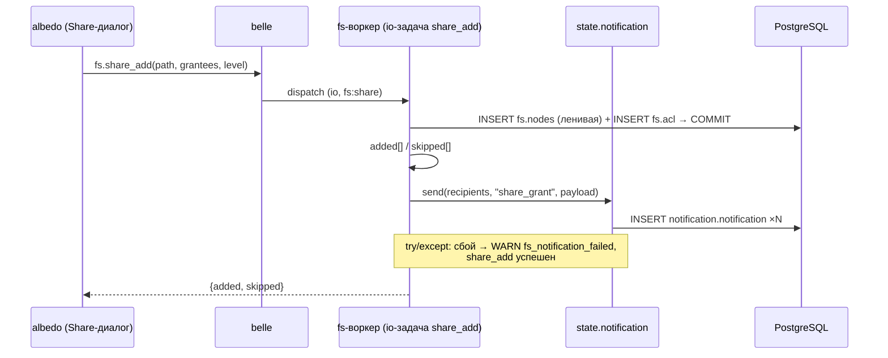
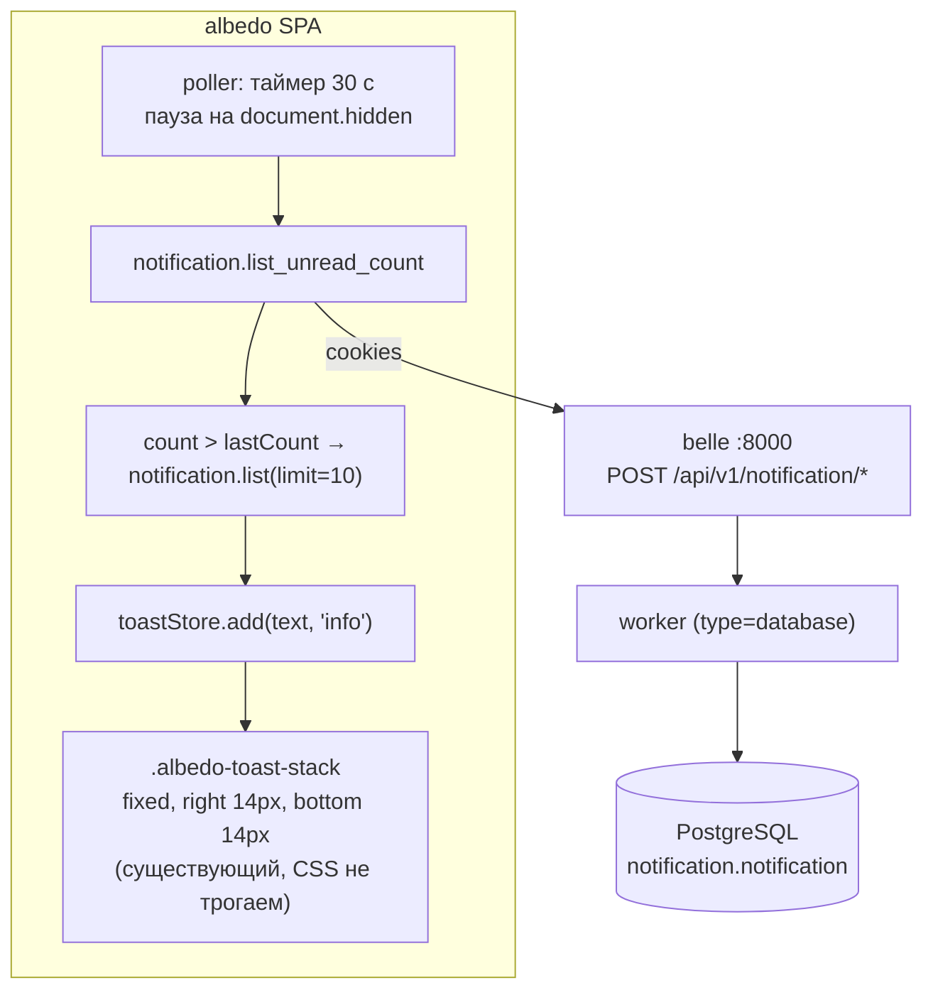
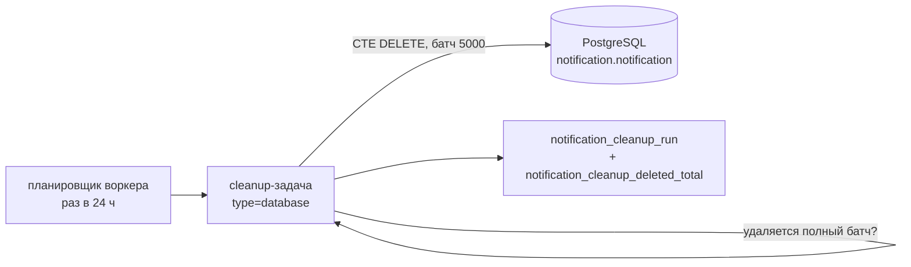

# ADR-003: Модуль mia-notification — внутренние уведомления и доставка в albedo

| Поле | Значение |
|------|----------|
| **Статус** | accepted — вердикты Мастера от 02.09.2026 (schema review Норы внесено в ревизию 3; передана Соне) |
| **Дата** | 2026-09-02 (accepted 02.09.2026; ревизия 3 — schema review Норы) |
| **Ревизия 3** | schema review Норы (02.09.2026): фильтр получателей `is_active = TRUE AND NOT is_disabled` (колонки `active` в auth.users нет), чанковый INSERT distribute через JOIN auth.users — устойчивость к FK-гонке |
| **Авторы** | Эна (architect) |
| **Проекты** | mia-notification (новый репо → `mia/modules/notification`), mia-fs (один вызов), belle, mia-worker, albedo |
| **Связанные** | albedo ADR-002 (fs, identity-ACL — источник сценария `share_grant`), belle ADR-003 (named pools, схема БД), ADR-004 (apply один раз под lock), albedo ADR-001 (транспорт, cookies); `albedo/plan-admin.md` (инварианты §2) |
| **Стандарты** | `docs/CODING_STANDARD.md`, `docs/LOGGING_STANDARD.md`, `docs/OBSERVABILITY_STANDARD.md` |
| **Код не в этом ADR** | Сона не трогает репы до accepted Мастером |

---

## Решение (одна строка)

Новый модуль `mia/modules/notification`: таблица `notification.notification` в системной БД belle (персистентные уведомления — «не теряются после офлайна»), фасад `state.notification.send(recipients, type, payload, bucket)` для других модулей (первый вызыватель — fs после `share_add`), self-scope RPC `notification.list / list_unread_count / mark_read / mark_all_read` на воркере, доставка в albedo — polling `list_unread_count` (30 c) поверх существующего toast-стека (внизу справа) **+ колокольчик с бейджем unread, звук на новый share_grant-тост, клик по тосту = пауза исчезновения**; Everyone-гранты — асинхронная батчевая раздача воркером `notification.distribute`; TTL 30 дней, cleanup — периодическая воркерная задача; WebSocket и внешние каналы (email/push) — волна N+1.

---

## 1. Контекст и мотивация

Мастер заказал модуль уведомлений: «Уведомления от системы. Первый сценарий: при `share_add` получателям приходит уведомление "Пользователь {name} предоставил вам доступ к папке/файлу {name}"». Требования к доставке:

1. Тосты в albedo — **внизу справа**.
2. **Уведомления не теряются**: пользователь офлайн — увидит после входа.

Факты из кода:

| Факт | Источник |
|------|----------|
| Каталог `mia/modules/notifications` существует, но это **EventBus-демо-заглушка** («Не используется в проде. Удалите его перед деплоем»): подписка на `data.processed`, логирование | `modules/notifications/__init__.py`, `README.md` |
| EventBus — **in-memory, в рамках процесса**: `subscribe(event, handler)` хранит handlers в памяти; publish по всей глубине асинхронности/ретраев/персистентности не имеет | `mia/communication/event_bus.py` |
| Тост-стек albedo: `.albedo-toast-stack` = `position: fixed; right: 14px; bottom: 14px; column-reverse` — **уже внизу справа**; API: `toast(text, kind?)` / `useToastStore.add(text, kind)`, `kind ∈ {error, ok, info}`; авто-dismiss 10 c, fade с 2 c, freeze на hover | `src/theme/tokens.css`, `src/shared/toast/toastStore.ts`, `ToastView.tsx` |
| Модули вешают фасады на Application атрибутом: `state.llm = provider` (`llm/__init__.py:89`), `state.fs` (ADR-002 §3), `state.workspace` | код mia |
| SQL только на воркере — инвариант плана; RPC через `@task(api=True, type=..., permission=...)` | `plan-admin.md` §2, `llm/provider.py` |
| Схемы накатываются one-shot `migrate` в topo-порядке `_MODULES` под advisory lock | belle ADR-004 |

Что НЕ делаем (ограничения Мастера): без WebSocket в v1; без email/push-каналов — только внутренние уведомления; модель людей не дублируется (FK на `auth.users`); SQL только в воркере.

---

## 2. Границы модуля notification

| Владеет | Не делает |
|---------|-----------|
| Таблица `notification.notification` (схема `notification`) и весь свой SQL | Не пишет в чужие схемы (fs, auth) |
| Фасад `state.notification` — единственная точка входа для других модулей | Не читает диск, не знает про fs.nodes (uuid приходит в payload как данные) |
| RPC `notification.*` (self-scope) | Не рассылает email/push/WS — только строки в БД |
| Форматирование payload ← на фронте; бэк отдаёт структурированные данные | Не хранит тексты уведомлений на бэке (i18n — забота UI) |

Правило зависимостей: **fs → notification (одна стрелка, через фасад)**; notification → fs — никогда. notification → auth — только FK и резолв получателя в своей схеме.

---

## 3. state.notification — интерфейс на Application

Мастер предложил синтаксис `state.notification()` (со скобками). **Politely отклоняем**: все фасады платформы — атрибуты, а не вызываемые объекты (`state.fs`, `state.llm`, `state.workspace`). Единообразие важнее локальной элегантности: скобки намекали бы на «создание уведомления», а фасад — про сервис целиком (send + чтение + статусы). Зафиксировано как свойство `state.notification`.

```python
# NotificationModule(ModuleBase).on_load:
state.notification = NotificationAccessor(database, log)

class NotificationAccessor:
    # ── Для других модулей (fs и будущие) ──────────────────────
    def send(recipients: list[uuid], type: str, payload: dict, *, bucket: str) -> int
        # СИНХРОННЫЙ путь (≤ NOTIFICATION_DISTRIBUTE_THRESHOLD получателей).
        # INSERT по одному получателю; возвращает число записанных.
        # recipients = uuid пользователей (fs резолвит обычные группы сам
        # и передаёт ТОЛЬКО конкретных пользователей; см. §6.1);
        # bucket — метка операции-источника (для dedup_key, §4.2).

    def distribute(type: str, payload: dict, scope: dict, *, bucket: str) -> str
        # ФОНОВЫЙ путь (> NOTIFICATION_DISTRIBUTE_THRESHOLD, Everyone).
        # Ставит воркерную задачу notification.distribute и ВОЗВРАЩАЕТСЯ СРАЗУ
        # (возвращает distribute_id). scope = {"kind": "all_active"}
        # (Everyone) | {"kind": "explicit", "user_ids": [...]} (большая группа:
        # fs резолвит membership сам, §6.1). Детали — §6.1.

    # ── Для своих RPC ──────────────────────────────────────────
    def list(recipient: uuid, *, limit: int, before: tuple[datetime, uuid] | None,
             unread_first: bool = True) -> list[dict]
    def unread_count(recipient: uuid) -> int
    def mark_read(recipient: uuid, notification_id: uuid) -> bool
    def mark_all_read(recipient: uuid) -> int
```

- Каждый метод принимает получателя **явным аргументом** — RPC-слой подставляет `_session_user_id`; фасад никогда не берёт пользователя из глобального контекста (тестируемость изолированно).
- `send` — синхронный INSERT; вызывается **из тела воркерной задачи** вызывающего модуля (§8) — инвариант «SQL только в воркере» не нарушается.

---

## 4. Таблица `notification.notification` (системная БД belle, схема `notification`)

### 4.1. DDL

```sql
CREATE TABLE IF NOT EXISTS notification.notification (
    id                UUID PRIMARY KEY DEFAULT gen_random_uuid(),
    recipient_user_id UUID NOT NULL REFERENCES auth.users(id) ON DELETE CASCADE,
    type              VARCHAR(32) NOT NULL CHECK (type IN ('share_grant')),
    payload           JSONB NOT NULL DEFAULT '{}',
    dedup_key         TEXT NOT NULL,          -- sha256(actor_id|node_uuid|type|bucket); идемпотентность раздачи
    read_at           TIMESTAMPTZ,
    created_at        TIMESTAMPTZ NOT NULL DEFAULT NOW(),

    CONSTRAINT notification_recipient_dedup_key UNIQUE (recipient_user_id, dedup_key)
);

-- список: свои уведомления, непрочитанные сверху, новые сверху
CREATE INDEX IF NOT EXISTS notification_recipient_unread_idx
    ON notification.notification (recipient_user_id, read_at NULLS FIRST, created_at DESC);
-- счётчик непрочитанных: index-only scan
CREATE INDEX IF NOT EXISTS notification_recipient_read_idx
    ON notification.notification (recipient_user_id, read_at)
    WHERE read_at IS NULL;
-- cleanup: батчевый DELETE по возрасту (§15.4, вердикт 1)
CREATE INDEX IF NOT EXISTS notification_created_at_idx
    ON notification.notification (created_at);
```

### 4.2. Решения по колонкам

| Колонка | Почему так |
|---------|-----------|
| `recipient_user_id FK → auth.users ON DELETE CASCADE` | Источник истины о людях — auth (инвариант плана); уведомление удалённого юзера не нужно |
| `type` CHECK по списку констант | Явная эволюция схемы (как `level` в `fs.acl`): новый тип = миграция `ALTER ... CHECK`, не тишина. v1: только `share_grant` |
| `payload JSONB` — `{actor_name, node_name, node_uuid, node_kind, level}` | Схема payload гибкая, **без FK на `fs.nodes`**: уведомление — лог факта; узел может уйти в trash/быть удалён — уведомление обязано пережить это (требование «не теряются»). `node_uuid` — данные для перехода «клик → открыть папку», фронт проверяет живость узла сам |
| `read_at TIMESTAMPTZ NULL` | NULL = непрочитано. Отдельно прочитанное не удаляем: TTL 30 дней по `created_at` — вердикт 1 (02.09.2026); прочитанное и непрочитанное стареют вместе (формулировка вердикта: «записи старше 30 дней удаляются», §15.4) |
| `dedup_key TEXT NOT NULL` + `UNIQUE (recipient_user_id, dedup_key)` | Идемпотентность: рестарт воркера `distribute` (§6.1) не задаваивает уведомление — повторный INSERT гасится `ON CONFLICT DO NOTHING`. Ключ = `sha256(actor_id | node_uuid | type | bucket)`, где `bucket` — метка операции-источника (fs передаёт момент share_add, одно значение на всю рассылку): рестарт той же рассылки даёт тот же ключ, повторное событие share_add — другой |
| `payload.actor_id` (новое поле payload) | Стабильный идентификатор автора для `dedup_key` (имя `actor_name` может измениться/быть неуникальным); фронту пригодится для будущих типов |
| Нет `updated_at` | Единственная мутация — `read_at`; для аудита хватает `created_at` + `read_at` |

Индексы: `notification_recipient_unread_idx` обслуживает `list` (unread-first сортировка), `notification_recipient_read_idx` (частичный) — `list_unread_count` как index-only scan. Кардинальности per-user в метриках нет — тут лейблов нет вовсе.

---

## 5. RPC-поверхность notification.*

Транспорт: `POST /api/v1/notification/{method}`, envelope `{data, error, meta}`, HttpOnly cookies (albedo ADR-001). Тип задач — **`type="database"`** (чистый SQL, без диска и сети).

```
notification.list(limit = 50, before?(created_at, id), unread_first = true)
  → { items: [ { id, type, payload, read_at, created_at } ], next_cursor: str|null }
  # пагинация курсором (created_at, id); unread-first: NULL read_at сверху
  # (внутри обеих групп — по created_at DESC)

notification.list_unread_count()
  → { count: int }

notification.mark_read(id: uuid)
  → { marked: bool }
  # id чужого уведомления → marked: false (не ошибка: нет утечки факта существования)

notification.mark_all_read()
  → { marked: int }
```

Permission — **минимальный baseline: только аутентификация, без нового права**:

- Уведомления — строго личные данные: каждый метод жёстко скоупится `WHERE recipient_user_id = :_session_user_id`; «право читать свои уведомления» есть у каждого аутентифицированного пользователя по определению.
- Вводить `notification:read` и раздавать его всем ролям — шум: право, которое есть у всех, ничего не защищает (принцип плана «не раздувать»).
- Авторизация = аутентификация + scoping. **Аналог: `auth.get_me`** — self-профиль без permission.
- **Вердикт Мастера №5 (02.09.2026): baseline согласован** — permission не вводим; если позже понадобится единый стиль, добавляется одной миграцией CHECK'а в AUTH_SCHEMA, контракт RPC не меняется.

---

## 6. Сценарий v1: share_grant

Триггер: `fs.share_add` после успешного коммита грантов, по списку `added[]` (ADR-002 §8.1).

```
state.notification.send(
    recipients = [g.grantee_id for g in added if g.type == "user"],
    type       = "share_grant",
    payload    = {
        "actor_id":   "<uuid владельца>",
        "actor_name": "<username владельца>",
        "node_name":  "<display_name узла>",
        "node_uuid":  "<uuid узла fs.nodes>",
        "node_kind":  "dir" | "file",
        "level":      "viewer" | "editor",
    },
    bucket     = "<метка операции share_add, одно значение на вызов>",
)
```

Текст сообщения **не хранится на бэке** — фронт форматирует из payload (§9.2): «Пользователь {actor_name} предоставил вам доступ к папке/файлу {node_name}». Бэк не знает язык пользователя; payload — структура, UI — слова.

### 6.1. Группы и Everyone — два пути (вердикт 4, 02.09.2026)

**Вердикт Мастера: Everyone-грант — уведомления СЛАТЬ, но батчами через воркеры.** Порог большого получателя: `NOTIFICATION_DISTRIBUTE_THRESHOLD = 50` — до 50 строк это миллисекунды INSERT в уже идущей задаче fs; сотни и тысячи — заметная пауза `share_add` и окно деградации, значит фоново.

| Случай | Путь | Кто резолвит получателей |
|--------|------|--------------------------|
| Юзеры и обычные группы, `N ≤ 50` | `state.notification.send(...)` — синхронно в задаче fs (§8.4) | fs (SELECT membership — его домен, §2) |
| Everyone или любая группа, `N > 50` | `state.notification.distribute(...)` — асинхронно, воркерная задача notification | Everyone: notification сам (`SELECT id FROM auth.users WHERE is_active = TRUE AND NOT is_disabled` — резолв получателя в auth разрешён §2; schema review Норы: колонки `active` в auth.users нет — есть `is_active` и `is_disabled`). Большая группа: fs резолвит membership и передаёт `{"kind": "explicit", "user_ids": [...]}` |

**Механизм задачи `notification.distribute(type, payload, scope, bucket)` — выбран вариант «одна задача с внутренними чанками и COMMIT по чанку»** (цепочка задач в очереди отклонена — см. §17):

1. Задача резолвит получателей из `scope` **курсором** (keyset по `auth.users.id` для `all_active`; пагинация по списку для `explicit`), чанками по `NOTIFICATION_DISTRIBUTE_CHUNK = 500`. Фильтр получателей: `is_active = TRUE AND NOT is_disabled` (schema review Норы: колонки `active` в auth.users нет).
2. Каждый чанк — один multi-row `INSERT ... SELECT ... JOIN auth.users u ON u.id = :recipient ... ON CONFLICT (recipient_user_id, dedup_key) DO NOTHING` + **COMMIT** (schema review Норы: JOIN с `auth.users` делает чанк устойчивым к FK-гонке — юзер, удалённый между резолвом курсора и INSERT'ом, тихо не сматчится в JOIN, чанк не падает с FK violation). Прогресс переживает падение: перезапущенная задача повторяет чанки, конфликты гасятся дедупом.
3. `dedup_key = sha256(actor_id | node_uuid | type | bucket)` — одинаковый внутри одной рассылки, разный для разных событий. **Рестарт воркера не задаваивает** (UNIQUE из §4.1); отдельный персистентный курсор рестарта не нужен — дедуп дешевле и покрывает тот же случай (повтор с начала = серия дешёвых no-op конфликтов).
4. **Ответ `share_add` возвращается СРАЗУ**: fs ставит distribute и не ждёт; раздача догоняет с лагом очереди. Контракт ответа не меняется (`added[]`/`skipped[]` — те же).
5. Наблюдаемость: `notification_distribute_progress{total, done}` (Gauge, обновляется по чанкам) + лог `notification_distribute_chunk` на каждый чанк.

Ограничение Gauge: при параллельных раздачах метрика показывает последнюю задачу — частота Everyone-грантов низкая, для параллельных есть чанковые логи.

---

## 7. Уведомления не теряются (инвариант)

| Условие | Гарантия | Механика |
|---------|----------|----------|
| Получатель офлайн в момент `share_add` | Увидит после входа | Строка в БД написана; первый `notification.list`/`list_unread_count` после логина вернёт непрочитанное |
| Вкладка albedo закрыта | То же | Polling — клиентская логика; данные живут в БД, не в сокете |
| Модуль notification не ответил в момент выдачи гранта | Грант не теряется; уведомление может потеряться | fs зовёт `send` в try/except (§8.2): сбой = WARN-лог + метрика, `share_add` успешен; **рассинхрон «грант есть, уведомление нет» допустим и наблюдаем** (reverse-недостижимо: уведомление без гранта не создаётся) |
| Повторный `share_add` (идемпотентный) | Дублей уведомлений нет | Уведомление — только по `added[]`; `skipped[]` не уведомляется (ADR-002 §8.1) |
| Everyone-грант: раздача асинхронная (§6.1) | Уведомление придёт позже (лаг очереди), но гарантированно | Задача `distribute` персистентна в очереди; чанковые COMMIT сохраняют прогресс; рестарт воркера гасится `UNIQUE (recipient, dedup_key)` — дублей нет |
| Cleanup удаляет запись (§15.4) | Осознанная потеря по TTL | Вердикт 1: записи старше 30 дней удаляются, включая непрочитанные; TTL жёсткий и предсказуемый |

---

## 8. Как fs вызывает notification — выбранный вариант

### 8.1. Варианты

| Вариант | Суть |
|---------|------|
| **A. Прямой вызов** | `state.notification.send(...)` из тела fs-задачи; `ModuleMeta(dependencies=["notification"])` у fs |
| **B. Event bus** | fs публикует `fs.shared`, notification подписан в своём `on_load`; fs не знает о подписчиках |

### 8.2. Выбор: A — прямой вызов с graceful-деградацией

```python
# fs/provider.py, тело share_add, после коммита грантов:
try:
    state.notification.send(recipients, "share_grant", payload)
    METRICS["fs_share_notifications_sent"].inc()
except Exception as exc:                      # уведомление не валит share_add
    log.warning("fs_notification_failed",
                extra={"node_uuid": ..., "recipients": len(recipients), "error": str(exc)})
    METRICS["fs_share_notification_failures"].inc()
```

**Почему не event_bus (B):**

1. **Бизнес-гарантия vs fire-and-forget.** Уведомление — часть контракта шаринга («получатель узнал»). EventBus mia — in-memory структура процесса: без персистентности, без ретраев, без очереди. Событие, опубликованное в пустоту (модуль не загружен / воркер без notification в `MIA_WORKER_MODULES`), **теряется молча** — это худший режим для бизнес-гарантии.
2. **Диагностируемость.** Прямой вызов падает в стеке fs-задачи → один WARN-лог с контекстом узла. Потерянное событие шины не оставляет и следа.
3. **Видимая зависимость.** `dependencies=["notification"]` в ModuleMeta — топологический порядок загрузки гарантирует `state.notification` к моменту вызова; шина скрывает контракт до чтения чужого `on_load`.
4. Шина останется правильным ответом для **декоративных** подписчиков (лог-стрип, метрики) — когда такие появятся.

**Почему fs не пишет в таблицу notification сам:** fs знает фасад, не схему (§2). SQL уведомления принадлежит notification — модуль меняет свою схему, не трогая соседей.

### 8.3. Границы модулей при записи (вопрос Мастера)

Инвариант «SQL только в воркере» соблюдён **уже** тем, что `share_add` — воркерная задача fs (`type="io"`): вызов `state.notification.send` происходит внутри той же воркерной задачи, INSERT выполняется на воркере. Два под-вопроса:

- **Рекурсивный dispatch** (fs-задача ставит новую `notification.*` задачу в очередь) — отклонён: вложенная диспетчеризация усложняет трассировку, добавляет окно потери (очередь упала — уведомления нет), а выигрыша нет: мы уже на воркере, синхронный INSERT дешевле и атомарнее по наблюдению.
- **Прямой INSERT через чужой TableGateway** — отклонён: нарушает границы (fs знает схему notification).

**Итог: fs-воркерная задача вызывает `state.notification.send()` → notification выполняет свой INSERT в той же задаче.** Запись — владельца схемы; исполнение — воркер вызывающей задачи; сбой — graceful (§8.2).

### 8.4. Порядок операций в share_add

```
1. OWNER-проверка + ленивая регистрация fs.nodes
2. INSERT fs.acl (added[]/skipped[])          ← транзакция fs-репозитория, COMMIT
3. Ветвление по |added_user_ids| (§6.1):
   N ≤ 50  → state.notification.send(...)      ← синхронно, INSERT'ы здесь же
   N > 50  → state.notification.distribute(...)==> очередь; ответ не ждёт
4. try/except вокруг шага 3 (§8.2)
5. Ответ share_add {added, skipped} — СРАЗУ в обоих случаях
```

Шаг 3 **после** коммита: грант не откатывается из-за уведомления (требование Мастера). Цена — окно «грант есть, уведомления нет» при падении шага 3; покрывается WARN + метрикой, авто-ретраи — вне v1 (outbox-паттерн — волна N+1, §11). Для `N > 50` окно растягивается на время очереди — осознанно (вердикт 4): инвариант «не теряются» сохраняется персистентностью задачи, см. §7.

---

## 9. Доставка на фронт (albedo)

### 9.1. Polling — WebSocket не делаем (волна N+1)

| Параметр | Значение | Почему |
|----------|----------|--------|
| Метод | `notification.list_unread_count` | count = index-only scan (§4.1); дешёв даже на 30-секундном тике |
| Интервал | 30 c | Задержка доставки ≤ 30 c — достаточна для тостов; WS сократит до 0 — не оправдан в v1 |
| Пауза | `document.hidden` → таймер стоит; `visibilitychange` → немедленный тик | Не долбим сервер из фоновых вкладок |
| Аутентификация | те же HttpOnly cookies | albedo ADR-001 |
| Логика | `count > lastCount` → `notification.list(limit=10, unread_first=true)` → тосты для `id > lastSeenId`; **сам `count` отображается бейджем NotificationBell (§10.5)** | `lastSeenId` — max показанный id в памяти сессии (можно localStorage); без него — повтор тостов на каждом тике. Count — и триггер fetch, и значение бейджа: один RPC кормит оба элемента |

WebSocket (и SSE) — зафиксированы **волной N+1**: появится отдельный ADR (канал, ping/pong, реконнект, подписка на сервере). Контракт payload ниже не изменится — меняется только транспорт доставки сигнала «есть новое».

### 9.2. Маппинг payload → toast (точный контракт на существующий API)

Стек уже внизу справа: `.albedo-toast-stack { position: fixed; right: 14px; bottom: 14px; }` (`src/theme/tokens.css:625`) — **CSS не меняется**, требование Мастера выполняется существующей системой.

```typescript
// src/features/notifications/notificationPoller.ts (новый файл)
import { toast } from '../../shared/toast/toastStore';

function formatText(type: string, p: Record<string, unknown>): string {
  if (type === 'share_grant') {
    const what = p.node_kind === 'file' ? 'файлу' : 'папке';
    return `Пользователь ${p.actor_name} предоставил вам доступ к ${what} «${p.node_name}»`;
  }
  return `Уведомление: ${type}`;   // fallback для будущих типов
}

// на каждый новый item из notification.list:
toast(formatText(item.type, item.payload), 'info');
//   → useToastStore.add(text, 'info')
//   kind = 'info' (не error!): синяя полоса --info, иконка bi-info-circle-fill
//   авторазкрытие: fade через 2 c (FADE_DELAY), dismiss через 10 c (DISMISS_DELAY),
//   freeze на hover — уже в toastStore; клик-пауза добавляется вердиктом 6 (§10.5)
// если в тике были новые share_grant → один звуковой сигнал на тик (§10.5, до тостов)
```

| Поле payload | В тост |
|--------------|--------|
| `actor_name` | подставка в текст |
| `node_kind` (`dir`/`file`) | выбор слова «папке»/«файлу» |
| `node_name` | подставка в текст (в «» — кириллица встречается сплошь) |
| `node_uuid`, `level`, `actor_id` | в тост не попадают. **Переход в папку по клику ОТКЛОНЁН Мастером навсегда** (вердикт 6, 02.09.2026: «клик — только задержка исчезновения»); `node_uuid`/`actor_id` остаются данными payload (нужны для `dedup_key`, §4.2), UI их не использует |

Пакет из N новых уведомлений: до 10 тостов за тик (лимит `list`); больше — счётчик «+N уведомлений» одним тостом (дедупликация фронта).

---

## 10. Контракт для albedo (только данные, без дизайна)

### 10.1. Скрытие по permissions

| Условие | Поведение фронта |
|---------|------------------|
| `fs:share` отсутствует | Диалог Share не открывается, ПКМ-пункт скрыт |
| Аутентификация есть | Poller уведомлений работает у всех (baseline §5) |

### 10.2. share_list — иконка отключённого пользователя (вердикт ADR-002 №4)

```jsonc
// fs.share_list(path) →
{ "items": [
  { "grantee_type": "user",  "grantee_id": "uuid", "name": "ivanov",
    "active": false,           // ← disabled-юзер: фронт рисует иконку отключённого
    "level": "viewer", "created_at": "..." },
  { "grantee_type": "group", "grantee_id": "uuid", "name": "Everyone",
    "active": true, "level": "editor", "created_at": "..." }
] }
```

### 10.3. resolve_entities — ambiguous-выбор (вердикт ADR-002 №7)

```jsonc
// fs.resolve_entities(inputs[]) →
{ "results": [
  { "input": "ivanov",  "status": "resolved",
    "candidates": [ { "type": "user", "uuid": "...", "name": "ivanov", "email": "i@x.io" } ] },
  { "input": "мусор",   "status": "unresolved", "candidates": [] },          // красная строка
  { "input": "admins",  "status": "ambiguous",                              // список выбора:
    "candidates": [ { "type": "group", "uuid": "...", "name": "admins", "email": null },
                    { "type": "user",  "uuid": "...", "name": "admins", "email": "a@x.io" } ] }
] }
// ambiguous → UI показывает candidates списком; выбор «один / несколько / все»
// превращает выбранные candidates в grantees для share_add
```

### 10.4. Уведомления — polling-контракт

```jsonc
// notification.list_unread_count() → { "count": 3 }
// notification.list(limit=10) →
{ "items": [
  { "id": "uuid", "type": "share_grant",
    "payload": { "actor_name": "anna", "node_name": "Отчёты Q3", "node_kind": "dir",
                 "node_uuid": "uuid", "level": "editor" },
    "read_at": null, "created_at": "2026-09-02T12:00:00Z" }
], "next_cursor": "..." }
// notification.mark_read(id) → { "marked": true }
// notification.mark_all_read() → { "marked": 3 }
```

### 10.5. NotificationBell, звук и клик-пауза тоста (вердикты 2 и 6, 02.09.2026)

**Колокольчик и бейдж.** Новый компонент `src/features/notifications/NotificationBell.tsx`, размещается в `AppShell.tsx` внутри `.albedo-header-actions` **перед** `<UserChip />` (AppShell.tsx:107-108) — слева от пользователя, как принято в шапках. Иконка `bi-bell` / `bi-bell-fill` (bootstrap-icons уже в проекте). Бейдж = значение `count` из того же poller'а (`list_unread_count`, 30 c — отдельный запрос не нужен):

- `count > 0` → видимый бейдж с числом;
- `count > 99` → текст «99+» (порог отображения);
- `count = 0` → бейдж скрыт.

Клик по колокольчику → `notification.mark_all_read()` — единственный способ пользователя обнулить unread без отдельного списка (список уведомлений не в вердиктах; если появится — клик переосмысляется, контракт RPC не меняется). После ответа бейдж обнуляется локально без ожидания следующего тика.

**Звук.** В albedo нет ни одного аудио-ассета (проверено: `*.{mp3,ogg,wav}` в `src/` и `public/` — пусто). Фиксируется:

- Сона добавляет **один ассет `public/notification.ogg`** (короткий сигнал, ≤ 300 мс, тихий);
- воспроизведение в `notificationPoller`: **один сигнал на тик** при наличии новых share_grant (не на каждый тост — burst не устраивает какофонию), ДО показа тостов;
- через Web Audio: `new Audio('/notification.ogg').play()` — достаточно для одноразового сигнала, AudioContext не нужен;
- **политика автозвука**: браузер блокирует `play()` до первого user gesture. Реализация: `once`-слушатели `pointerdown`/`keydown` на `document` ставят флаг `soundUnlocked` (и опционально прогревают `audio.play().then(() => audio.pause()).catch(noop)`); звук играем **только если флаг стоит** — вкладка, открытая и не тронутая пользователем, молчит (по вердикту: «звук не играть, если вкладка только открыта»), без unhandled rejection. `document.hidden` защищает естественно: poller стоит, тиков нет.

**Клик по тосту — только задержка исчезновения** (вердикт 6: «просто задерживает тост от исчезновения»; переход в папку отклонён навсегда). Точная механика расширения `toastStore.ts` / `ToastView.tsx` (hover-freeze уже есть, клик-пауза — отдельный флаг, чтобы `mouseleave` не снимал её):

- в `Toast` добавляется `pinned: boolean`;
- `pause(id)`: `pinned = true` — таймеры `scheduleFade`/`scheduleAutoDismiss` при срабатывании проверяют `pinned` так же, как `frozen`, и ничего не делают;
- `resume(id)`: `pinned = false` + пересоздание обоих таймеров с **полным сроком** (`scheduleFade` + `scheduleAutoDismiss` заново — тот же паттерн, что у существующего `unfreeze`);
- `ToastView`: `onClick` на теле тоста → toggle `pause`/`resume`; **повторный клик → resume** (тост получает полный срок заново); крестик → `dismiss(id)` — закрывает из любого состояния (`pinned`/`frozen` снимаются);
- `mouseleave` при `pinned = true` паузу НЕ снимает (иначе клик-пауза бессмысленна): `unfreeze` от hover учитывает `pinned`.

---

## 11. Метрики и логирование

Метрики (Counter/Histogram, лейблы без cardinality):

| Метрика | Тип | Labels | Зачем |
|---------|-----|--------|-------|
| `notification_sent_total` | Counter | `type`, `outcome` (`ok`/`partial`/`failed`) | объём отправок; `partial` = часть получателей не записана |
| `notification_send_failures_total` | Counter | `caller` (`fs`/...) | graceful-провал send у вызывающего (§8.2) — алерт Мая на рост |
| `notification_rpc_total` | Counter | `operation`, `outcome` | объём RPC |
| `notification_rpc_duration_seconds` | Histogram | `operation` | латентность SQL |
| `notification_unread_total` | Gauge | — | снимается health-задачей, глобальный COUNT WHERE read_at IS NULL (не per-user!) |
| `notification_cleanup_deleted_total` | Counter | — | строки, удалённые cleanup-задачей (§15.4); рост при прогоне = TTL работает |
| `notification_distribute_progress` | Gauge | `total`, `done` | прогресс Everyone-раздачи (§6.1); `done == total` = раздача завершена |

Логирование по LOGGING_STANDARD v2.0 (структурированные события, ISO8601 UTC):

| Событие | Уровень | Мета |
|---------|---------|------|
| `notification_sent` | INFO | `type`, `recipients_count`, `duration_ms`, `caller` |
| `notification_send_failed` | WARN | `type`, `recipients_count`, `error_type`, `caller` |
| `notification_distribute_chunk` | INFO | `distribute_id`, `chunk_no`, `inserted`, `duplicates` (по чанкам, §6.1) |
| `notification_distribute_failed` | ERROR | `distribute_id`, `scope_kind`, `error_type` — задача упала; рестарт очереди подхватит, дедуп не даст дублей |
| `notification_cleanup_run` | INFO | `deleted`, `duration_ms`, `batches` |
| `notification_read` | INFO | `operation` (`mark_read`/`mark_all_read`), `marked_count` |
| `notification_rpc_failed` | ERROR | `operation`, `error_type`, `duration_ms` |
| `notification_module_loaded` / `unloaded` | INFO | `version` |

Правила: не логировать содержимое payload (там имена людей и путей — только count и тип); security-событий нет — данных для атаки в RPC нет (strict self-scope).

---

## 12. Конфигурация

```python
@dataclass
class NotificationConfig:
    default_page_size: int = 50           # env NOTIFICATION_DEFAULT_PAGE_SIZE
    max_page_size: int = 200              # env NOTIFICATION_MAX_PAGE_SIZE
    poll_hint_seconds: int = 30           # env NOTIFICATION_POLL_HINT (отдаётся фронту в meta как рекомендация)
    max_batch_send: int = 500             # env NOTIFICATION_MAX_BATCH (потолок recipients за один send)
    ttl_days: int = 30                    # env NOTIFICATION_TTL_DAYS (вердикт 1; cleanup §15.4)
    cleanup_interval_hours: int = 24      # env NOTIFICATION_CLEANUP_INTERVAL_HOURS (периодичность cleanup-задачи)
    cleanup_batch_size: int = 5000        # env NOTIFICATION_CLEANUP_BATCH (строк за один DELETE)
    distribute_threshold: int = 50        # env NOTIFICATION_DISTRIBUTE_THRESHOLD (sync/async граница, §6.1)
    distribute_chunk: int = 500           # env NOTIFICATION_DISTRIBUTE_CHUNK (получателей на чанк, §6.1)
```

- `MiaConfig`/`BelleConfig` не расширяются — env модуля, образец `WorkspaceConfig.from_env`.
- `poll_hint_seconds` — единственная точка настройки интервала фронта: фронт читает значение из meta первого ответа, константа не дублируется в двух репо.

---

## 13. apply_schema и миграции

По belle ADR-004 (DDL — только one-shot migrate под advisory lock):

1. `notification/DB_SCHEMA`: схема `notification`, таблица (+ UNIQUE dedup-констрейнт) + 3 индекса (DDL §4.1). FK только на `auth.users`.
2. `NotificationModule.apply_schema(state)`: `register_schema("notification", DB_SCHEMA)`.
3. **Порядок в `belle/migrate.py`**: `_MODULES = ("db", "auth", "llm", "fs", "notification", "admin")` — notification **после fs**. FK на `fs.nodes` нет (§4.2: payload без FK), так что технически допустим и параллельный слот сразу после auth; выбираем после fs по двум причинам: (а) если волне N+1 понадобится FK `node_uuid` → перестановка `_MODULES` не потребуется, слот уже правильный; (б) читаемость: сценарий `share_grant` живёт в fs — схема-потребитель рядом со схемой-источником.
4. Идемпотентность: `CREATE ... IF NOT EXISTS`, сидов нет; повторный migrate безопасен.
5. Runtime CRUD — контур C `pgbouncer:6432`; DDL — контур B migrate.

---

## 14. Воркер, деплой и загрузка модулей

- `MIA_WORKER_MODULES` += `notification` → `db,auth,workspace,llm,admin,fs,notification` (env — источник истины). **Обязателен на воркерах, где крутится fs** — иначе `state.notification` в fs-задаче отсутствует и каждое `share_add` пишет WARN (гранты работают, уведомления нет). Рэй: единый env для всех воркер-контейнеров.
- RPC `notification.*` — `type="database"`, исполняются на db-пуле воркера.
- **Задача `notification.distribute`** (§6.1) — `type="database"`: только SELECT получателей + чанковые INSERT; ставится фасадом из fs-задачи, исполняется на db-пуле. Идемпотентна к рестарту (dedup §4.1).
- **Cleanup-задача** (§15.4) — `type="database"`, планировщик воркера notification ставит её раз в `cleanup_interval_hours` (24 ч). Не в fs-контуре: сбой cleanup не влияет на отправку.
- `ModuleMeta(dependencies=["log", "db"])` у notification (auth нужен только как FK-схема в БД, не как модуль-зависимость: резолв получателей делает вызывающий; исключение — `all_active`-курсор в distribute, это резолв получателя, разрешённый §2).
- Репозиторий: **mia-notification**, каталог `mia/modules/notification` (единственное число от «уведомление», как велит Мастер; не путать с демонстрационной заглушкой).
- **Заглушка `mia/modules/notifications` удаляется** в шаге 1 плана (её собственный README: «Удалите его перед деплоем»): два похожих имени модулей = гарантированная путаница в `MIA_WORKER_MODULES` и `state.*`.

---

## 15. Потоки

### 15.1. Отправка: share_add → уведомления → БД



### 15.2. Доставка: polling → тосты



### 15.3. Everyone-раздача: share_add → distribute → батчи (вердикт 4)

```mermaid
sequenceDiagram
  participant UI as albedo (Share-диалог)
  participant B as belle
  participant FW as fs-воркер (share_add)
  participant Q as очередь задач
  participant NW as notification-воркер (distribute)
  participant PG as PostgreSQL

  UI->>B: fs.share_add(path, [Everyone], level)
  B->>FW: dispatch (io, fs:share)
  FW->>PG: INSERT fs.acl → COMMIT
  FW->>FW: recipients резолв → N > 50 (Everyone)
  FW->>Q: state.notification.distribute(type, payload, all_active, bucket)
  FW-->>UI: {added, skipped} — СРАЗУ, раздачу не ждём
  loop чанки по 500, keyset-курсор по auth.users
    NW->>PG: INSERT ×500 SELECT..JOIN auth.users<br/>WHERE is_active AND NOT is_disabled<br/>ON CONFLICT (recipient, dedup_key) DO NOTHING
    NW->>PG: COMMIT (прогресс сохранён)
    NW->>NW: notification_distribute_progress{total, done}
  end
  Note over NW,PG: рестарт воркера → повтор чанков,<br/>дедуп гасит дубли;<br/>исчезнувший юзер тихо пропускается JOIN'ом —<br/>чанк не падает с FK violation
```

### 15.4. Cleanup: TTL 30 дней (вердикт 1)

Периодическая задача воркера notification (`type="database"`), раз в `cleanup_interval_hours` (24 ч), батчевый DELETE по `created_at`:

```sql
-- один батч (цикл, пока удаляется полный батч):
WITH batch AS (
    SELECT id FROM notification.notification
    WHERE created_at < NOW() - MAKE_INTERVAL(days => :ttl_days)   -- 30
    LIMIT :cleanup_batch_size                                      -- 5000
)
DELETE FROM notification.notification n USING batch WHERE n.id = batch.id;
```



**Выбранный механизм — периодическая задача (не ленивое удаление при записи).** Обоснование: горячий путь записи (`send`, чанки distribute) не несёт скрытой работы по подметанию — латентность `share_add` и чанков предсказуема; нагрузка cleanup изолирована, наблюдаема (метрика + лог) и ограничена батчем; ленивое удаление размазало бы DELETE по записи непредсказуемо и не дало бы честной метрики «удалено за проход». Batching по 5000: короткие транзакции не держат блокировки, не раздувают WAL одним махом. Непрочитанные старше 30 дней удаляются тоже — формулировка вердикта: «записи старше 30 дней удаляются», TTL жёсткий.

---

## 16. План декомпозиции (для Соны)

| Шаг | Что делает Сона | Готовность |
|-----|-----------------|------------|
| 1. Каркас + DDL | Репо mia-notification → `mia/modules/notification/`: `config.py`, `accessor.py` (NotificationAccessor: send + distribute), `NotificationModule` (on_load вешает `state.notification`), `provider.py` (RPC), `scheduler` (cleanup-тик), `apply_schema` (DB_SCHEMA), `ddl/001_notification.sql` (dedup_key, UNIQUE, 3 индекса §4.1); **удалить заглушку `modules/notifications`**; `MIA_WORKER_MODULES` += notification; `_MODULES` migrate += notification (после fs) | state.notification существует; migrate зелёный |
| 2. RPC | `notification.list / list_unread_count / mark_read / mark_all_read` с `@task(api=True, type="database")`, strict scoping по `_session_user_id` | RPC отвечают с фронта, чужие id не читаются |
| 3. Хук в fs | `ModuleMeta.dependencies` fs += `notification`; в `share_add` после коммита — ветвление §8.4: `N ≤ 50` → `send(bucket=...)`; `N > 50`/Everyone → `distribute(...)` (ответ сразу); try/except (§8.2) | share_add пишет уведомления ≤50 синхронно, Everyone — фоново; сбой send — WARN, гранты живы |
| 4. Cleanup-задача | Планировщик воркера: раз в 24 ч задача `type="database"` — CTE DELETE батчами по 5000 (§15.4); метрика `notification_cleanup_deleted_total`, лог `notification_cleanup_run` | записи старше 30 дней исчезают; метрика растёт |
| 5. Distribute-задача | `notification.distribute(type, payload, scope, bucket)` — `type="database"`: keyset-курсор по получателям, чанки по 500, multi-row `INSERT ... ON CONFLICT DO NOTHING` + COMMIT на чанк (§6.1, §15.3); метрика `notification_distribute_progress{total,done}`, лог `notification_distribute_chunk` | Everyone-грант раздаётся фоново; kill -9 воркера в середине → рестарт без дублей |
| 6. Фронт: poller + тосты | `notificationPoller` (30 c, pause on hidden, дедуп по `lastSeenId`) + маппинг payload→toast (§9.2) | Уведомление всплывает тостом внизу справа ≤30 c после share_add; офлайн-юзер видит тосты после входа |
| 7. Фронт: NotificationBell | `src/features/notifications/NotificationBell.tsx` в `AppShell.tsx` перед `<UserChip />`: иконка bi-bell + бейдж из count poller'а (>0 виден, >99 → «99+»); клик → `mark_all_read` (§10.5) | Бейдж отражает unread в ≤30 c; клик обнуляет |
| 8. Фронт: звук + клик-пауза | Ассет `public/notification.ogg`; unlock-флаг по первому pointerdown/keydown (§10.5); один сигнал на тик с новыми share_grant. `toastStore.ts`: флаг `pinned`, методы `pause`/`resume` (resume пересоздаёт таймеры с полным сроком); `ToastView.tsx`: onClick по телу → toggle pause/resume, крестик → dismiss из любого состояния (§10.5) | Звук на новый share_grant после user gesture (без жеста — тихо); клик задерживает тост, повторный — полный срок, крестик закрывает |

Тесты Катерины:

1. **RPC-пирамида**: все 4 RPC с cookies; чужой `mark_read(id)` → `marked: false`; скоуп list — только свои строки.
2. **Персистентность**: share_add при «офлайн» получателе (нет polling) → после «входа» `list_unread_count` ≥ 1, тост форматируется из payload.
3. **Идемпотентность**: повторный share_add → `skipped[]`, уведомлений не добавляется (`sent_total` не растёт).
4. **Graceful**: notification-модуль отключён → share_add успешен, WARN `fs_notification_failed`, метрика `notification_send_failures_total` растёт.
5. **Пагинация**: 120 уведомлений → курсорная выдача без дублей; unread-first порядок; `mark_all_read` обнуляет счётчик.
6. **Миграция**: два параллельных migrate безопасны; worker-ребёнок не делает DDL (belle ADR-004).
7. **Фронт**: пауза на hidden-вкладке; burst из 15 уведомлений → ≤10 тостов + «+N»; kind='info'.
8. **Cleanup**: вставить запись с `created_at = now() - 31 day` → прогон cleanup → строка удалена, свежие целы, `notification_cleanup_deleted_total` вырос на 1.
9. **Distribute-идемпотентность**: Everyone-грант на 120 юзеров → share_add отвечает сразу; в середине раздачи kill воркера → рестарт → итог ровно 120 уведомлений (дедуп), `progress{done}` доходит до `total`.
10. **Порог**: группа из 49 → синхронный `send` (уведомления в ответе share_add уже в БД); группа из 51 → `distribute` (в БД на момент ответа может быть пусто).
11. **Бейдж**: 150 непрочитанных → бейдж «99+»; `mark_all_read` по клику → бейдж скрыт.
12. **Звук**: после клика по странице новый share_grant → звук; вкладка открыта, жестов не было → тишина, ошибок в консоли нет; burst 15 → один сигнал.
13. **Клик-пауза**: клик по тосту на 9-й секунде → тост жив; mouseleave не снимает паузу; повторный клик → тост получает полный срок (10 c); крестик из pinned → закрыт.

---

## 17. Отклонённые альтернативы

| Вариант | Почему нет |
|---------|------------|
| **Event bus (`fs.shared` → подписка notification)** | In-memory шина без персистентности/ретраев: событие в пустоту теряется молча — несовместимо с бизнес-гарантией; зависимость невидима в Meta (§8.2) |
| **Рекурсивный dispatch** (fs-задача ставит notification-задачу) | Окно потери через очередь, усложнение трассировки; мы уже на воркере — синхронный INSERT дешевле (§8.3) |
| **fs пишет в `notification.notification` напрямую (TableGateway)** | Нарушение границ: fs знает чужую схему; рефакторинг notification ломает fs (§8.3) |
| **`state.notification()` как вызываемый фасад** | Единообразие: все фасады платформы — атрибуты (`state.fs/llm/workspace`); скобки лгут про семантику (§3) |
| **WebSocket в v1** | Инфраструктура (канал, реконнект, ping) не окупается для тостов; polling 30 c покрывает сценарий; WS — волна N+1 (§9.1) |
| **Email/push-каналы** | Ограничение Мастера; каналы = отдельный ADR (шаблоны, подписки, антиспам) |
| **Хранить готовый текст уведомления на бэке** | i18n и правки формулировок = деплой бэка; payload-структура + форматирование на фронте гибче (§6) |
| **FK `payload->node_uuid` на fs.nodes** | Уведомление — лог факта; trash/удаление узла не должен каскадно стирать уведомления (инвариант «не теряются») (§4.2) |
| **Denormalize `unread_count` счётчиком** | Преждевременно: частичный индекс даёт index-only scan; счётчик = рассинхронизации и инвалимдация на каждый read (§4.1) |
| **Уведомлять по Everyone-гранту всех юзеров синхронно** | INSERT × N в транзакции `share_add` — деградация ответа; **асинхронно-батчевый вариант ПРИНЯТ вердиктом 4** (§6.1: одна воркерная задача с чанковыми COMMIT и dedup) |
| **Раздача Everyone цепочкой задач в очереди** (N/500 задач-звеньев) | Координация звеньев, оркестровый оверхед, N точек отказа вместо одной; одна задача с внутренними чанками + COMMIT по чанку проще, идемпотентна по dedup-ключу и устойчива к рестарту (§6.1, вердикт 4) |
| **Персональная таблица unread в user-БД** | Уведомления приходят от чужих действий — запись в user-БД получателя из чужой задачи = ленивый provision чужой БД в неположенном месте; системная схема честнее |
| **Ленивое удаление по TTL при записи** | Скрытая работа в горячем пути `send`/distribute, непредсказуемая нагрузка, нет честной метрики «удалено за проход»; периодическая cleanup-задача изолирована и наблюдаема (§15.4, вердикт 1) |
| **Переход в папку по клику тоста** | Отклонено Мастером **навсегда** (вердикт 6, 02.09.2026: клик — только задержка исчезновения); `node_uuid` остаётся в payload как данные для дедупа |

---

## 18. Вердикты Мастера (02.09.2026) — все открытые вопросы закрыты

| # | Вопрос (бывший открытый) | Вердикт Мастера | Куда внесён |
|---|--------------------------|-----------------|-------------|
| 1 | TTL уведомлений | **30 дней** (рекомендация Эны 90 дней переиграна); cleanup — периодическая задача, батчевый DELETE по `created_at` | §15.4, §4.1, §12 |
| 2 | Звук и бейджи | **Делаем сейчас, в v1**: NotificationBell + бейдж unread («99+»), звук `notification.ogg` на новый share_grant, клик тоста = задержка исчезновения | §10.5, §9.1–9.2 |
| 3 | Broadcast (админ всем) | **Нет в v1 — окончательно** | §17 (email/push-каналы и broadcast — отдельный ADR при появлении) |
| 4 | Everyone-грант | **Уведомления СЛАТЬ**, батчами через воркеры: `notification.distribute`, чанки 500, COMMIT по чанку, dedup по `UNIQUE(recipient, dedup_key)`, ответ share_add сразу | §6.1, §15.3, §4.1 |
| 5 | Permission baseline | **Согласовано**: только аутентификация + scoping, без `notification:read` | §5 |
| 6 | Клик по тосту | **Только задержка исчезновения** (пауза таймера); переход в папку отклонён **навсегда** | §10.5, §9.2 |

---

## 19. Последствия и риски

### Положительные

- Уведомления персистентны: офлайн-пользователь ничего не теряет (инвариант §7).
- Единая точка отправки для всех будущих сценариев (llm, admin) — `state.notification.send`, новые типы через миграцию CHECK.
- fs получает зависимость на фасад, не на схему; границы модулей чистые.
- Фронт-контракт ложится на существующий toast-стек без единой строчки CSS.
- Everyone-раздача не держит `share_add`: ответ мгновенный, нагрузка размазана по чанкам, рестарты безопасны (вердикт 4).

### Цена

- Новый модуль/репо + строка в `MIA_WORKER_MODULES` и `migrate._MODULES`.
- +N INSERT на каждый share_add (N = число конкретных получателей в `added[]`).
- Polling 30 c — фоновый трафик (1 лёгкий RPC на активную вкладку; пауза на hidden).
- Everyone-грант → до `ceil(active_users / 500)` чанков INSERT в фоне; таблица растёт пропорционально числу рассылок × пользователей.
- +3 фронт-элемента (bell, звук, клик-пауза) — расширение `toastStore` и AppShell.

### Риски

| # | Риск | Митигация |
|---|------|-----------|
| 1 | Потеря уведомления при падении send при живом share_add (окно §8.4) | try/except + WARN + метрика `notification_send_failures_total` (алерт Мая); outbox-паттерн — волна N+1 |
| 2 | Рассинхрон `lastCount` фронта (пропущенный тик, гонка вкладок) | Дедуп по `lastSeenId` (max id), не по count; count — триггер fetch и значение бейджа |
| 3 | Взрыв таблицы (everyone-гранты, будущие типы) | Максимум recipients в send (§12); TTL 30 дней + cleanup §15.4 (вердикт 1); gauge `notification_unread_total` на health |
| 4 | FS-воркер без notification в MIA_WORKER_MODULES → уведомления тихо не пишутся | WARN на каждый share_add (не тихо: лог+метрика); Рэй фиксирует единый env; тест Катерины №4 |
| 5 | Payload-поля переименовывает fs → фронт молча ломает форматирование | Контракт payload зафиксирован в двух ADR (эта §6, ADR-002 §8.1); тест на формат текста (Катерина №2) |
| 6 | Cardinality метрик | Лейблы только `type/outcome/operation/caller` (§11), без recipient/uuid |
| 7 | Distribute-задача отстаёт (очередь забита) → Everyone-уведомления приходят с большим лагом | `notification_distribute_progress{total,done}` + лог по чанкам; алерт Мая на возраст задачи; лаг не теряет уведомления — только откладывает (§7) |
| 8 | Браузер блокирует звук без user gesture → юзер «не слышит» уведомления | By design (§10.5): играем только после первого жеста; вкладка без жестов молчит без ошибок; это ограничение всех браузеров, не баг |
| 9 | Cleanup на большой таблице без индекса → долгий DELETE | Индекс `notification_created_at_idx` заложен в v1 DDL (§4.1); батчи по 5000 не держат длинных блокировок |

---

## 20. Критерии приёмки

| # | Критерий |
|---|----------|
| 1 | `share_add` двумя разными пользователями → у обоих получателей в течение ≤30 c тост «Пользователь {name} предоставил вам доступ к папке/файлу {name}» внизу справа |
| 2 | Получатель офлайн на момент share_add → после входа видит непрочитанные (`list_unread_count` > 0) и тосты |
| 3 | Повторный share_add не создаёт уведомлений (только `added[]` уведомляется) |
| 4 | Отключённый от уведомлений воркер (без notification в env) не ломает share_add; WARN+метрика видны |
| 5 | `mark_read`/`mark_all_read` обнуляют счётчик; чужие id недоступны (strict scoping) |
| 6 | Два параллельных migrate безопасны; worker-ребёнок не делает DDL |
| 7 | Логи: `notification_sent` в INFO с count без payload; ни одно событие не логирует содержимое payload |
| 8 | **Бейдж**: колокольчик в хедере отражает unread (`count` из `list_unread_count`): >0 виден, >99 → «99+», `mark_all_read` по клику обнуляет |
| 9 | **Звук**: новый share_grant-тост после user gesture → один сигнал `notification.ogg` на тик; вкладка без жестов — тишина, без ошибок в консоли |
| 10 | **Клик тоста**: клик ставит паузу исчезновения; `mouseleave` паузу не снимает; повторный клик → полный срок заново; крестик закрывает из любого состояния |
| 11 | **Everyone-грант**: `share_add` отвечает сразу; `notification.distribute` раздаёт батчами по 500 с COMMIT по чанку; рестарт воркера в середине → без задвоений (`UNIQUE (recipient, dedup_key)`), `progress{done}` доходит до `total` |
| 12 | **Cleanup**: записи старше 30 дней удаляются (включая непрочитанные), батчами ≤5000; `notification_cleanup_deleted_total` растёт |
