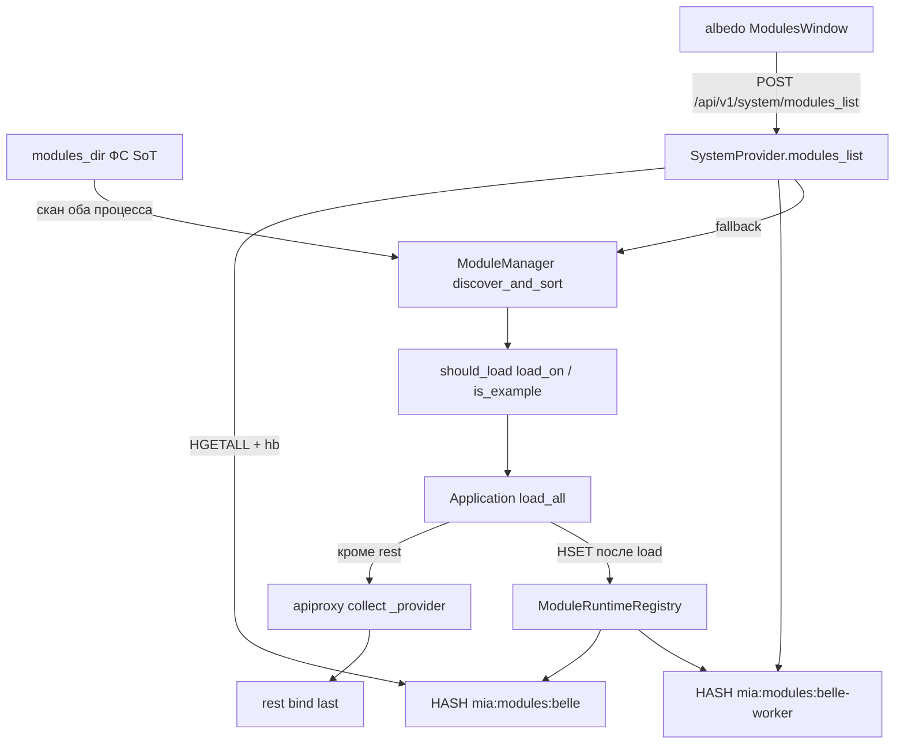
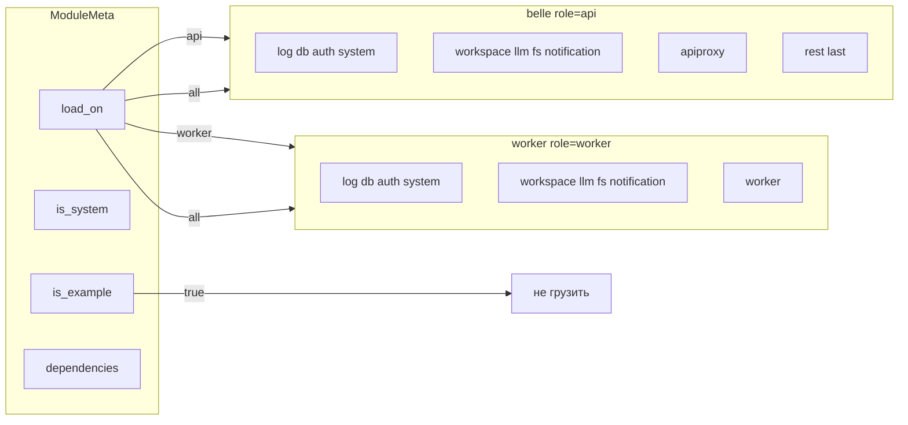

# ADR-005: Module discovery — ФС источник истины, Redis runtime registry

| Поле | Значение |
|------|----------|
| **Статус** | proposed |
| **Дата** | 2026-09-02 |
| **Авторы** | Эна (architect) |
| **Проекты** | mia (core, modules_system, apiproxy, system, worker), belle (app, compose, migrate), albedo (Modules UI) |
| **Связанные** | ADR-004 system-module (proposed): overlay, `state.system.modules`, RPC `modules_*`. **Этот ADR отменяет хардкод-списки из ADR-004 §2.1** (`_REQUIRED_MODULES`, `MIA_WORKER_MODULES`, `_DEFAULT_WHITELIST`, mapping Provider). Overlay / intent / `system.module` (PG) — без изменений роли. |
| **Стандарты** | `docs/CODING_STANDARD.md`, `docs/LOGGING_STANDARD.md` |
| **Код не в этом ADR** | Сона не пишет код, пока Мастер не accepted |

---

## Решение (одна строка)

Какие модули **существуют** — папки верхнего уровня `modules_dir` с `__init__.py`. Какие **загружать и в каком порядке** — `ModuleMeta` (`load_on`, `is_example`, `dependencies`) + topo-sort (уже есть `discover_and_sort`). Redis HASH `mia:modules:{service}` — **снимок runtime** (status/health/pid), не каталог для load. Воркер **не ждёт** belle. Whitelist и Python-списки модулей — удалить.

---

## 1. Контекст

Список Modules на фронте пустой: `SystemProvider.modules_list` возвращает `{"items": []}`.

Инвентарь (02.09.2026):

| Уже есть (не изобретать) | Где |
|--------------------------|-----|
| `ModuleManager.discover()` — папки с `__init__.py` | `mia/modules_system/module_manager.py` |
| `discover_and_sort()` — Kahn, `meta.dependencies` через AST | то же |
| `Application.load_all_modules()` | `mia/core/application.py` |
| `module._provider` на воркере | `core/dispatch/tasks.py` |
| AST `_parse_module_meta_call` → `ModuleMeta(**kwargs)` | новые поля подхватятся, если литералы |

Хардкод, который **убивает** discovery:

| Что | Где |
|-----|-----|
| `_REQUIRED_MODULES` tuple | `belle/app.py` — belle грузит **только** его, не `load_all` |
| `MIA_WORKER_MODULES` + default `"db,auth,workspace"` | `belle/docker-compose.yml` (два значения!), `mia/core/dispatch/tasks.py` → `allowed_modules=` |
| `_DEFAULT_WHITELIST` + `MIA_APIPROXY_WHITELIST` | `apiproxy/__init__.py`, `apiproxy/config.py`, compose, `belle_config.ApiProxySection` |
| `_resolve_provider_class` mapping имён → классов | `apiproxy/__init__.py`; тест `test_collect_map.py` |
| `_MODULES` migrate | `belle/migrate.py` |
| `allowed_modules` как **обязательный** фильтр discover | `ModuleManager.discover()` skip not-in-list |

Следствия: новый модуль = правка Python + compose + whitelist + mapping. rest в topo может встать **до** fs/system (зависит только от apiproxy) — collect в `on_load` не видит поздних провайдеров. sample/cli в локальном `mia/modules/` попадут в belle, если просто включить `load_all`.

Ограничения Мастера: Redis не единственный список для load; оба процесса сканируют ФС сами; UI через RPC `system.modules_list`; шаги Соны строго последовательно.

---

## 2. Восемь решений

### D1. Два источника, разная роль

- **ФС `modules_dir`** — единственный источник «модуль существует». Критерий: директория верхнего уровня + `__init__.py`. Overlay (ADR-004) решает **какой файл** грузить, не «есть ли имя в Redis».
- **Redis** — runtime registry: status, version, health, pid, service, error. Пишется **после** попытки load. Читается UI / `modules_list`.
- belle и belle-worker **независимо** `discover` → filter → topo → load → пишут **свой** HASH. Воркер не GET'ает снимок belle и не ждёт его ключ.

Отклонено: Redis как очередь загрузки (воркер встанет, если belle ещё не опубликовал). Отклонено: PG `system.module` как каталог существования (таблица ADR-004 остаётся для **intent**/overlay, не для list-на-старте).

### D2. Очередь загрузки = topo-sort

`load_all_modules()`: `discover_and_sort()` → filter `should_load(meta, role)` → load по порядку.

Ядро первым **только** потому что `db.meta.dependencies=["log"]`, `auth` → `db`, и т.д. Не потому что кортеж в `app.py`. Цикл → `ValueError` как сейчас.

`allowed_modules` остаётся **опциональным** аргументом конструктора для тестов. Прод / воркер / belle **не** передают список из env. Skip sample/cli — только метаданные.

### D3. ModuleMeta — минимальное расширение

```
load_on: Literal["api", "worker", "all"]   # default "all"
is_system: bool                             # default False
is_example: bool                            # default False
display_name: str                           # default = name
```

`should_load(meta, role)`:

1. `is_example` → никогда не грузить в belle/worker/migrate.
2. `load_on == "all"` → да.
3. иначе `load_on == role` (`role="api"` у belle REST, `"worker"` у celery child).

Назначение существующих модулей (Сона проставляет в `meta`, не в compose):

| Модуль | load_on | is_system | is_example |
|--------|---------|-----------|------------|
| log, db, auth, system | all | true | false |
| apiproxy, rest | api | true | false |
| worker | worker | true | false |
| workspace, llm, fs, notification | all | false | false |
| sample, cli | all (игнор) | false | **true** |

`display_name` — человекочитаемое имя в UI. AST уже парсит str/bool/list через `ast.Constant`.

Unload ядра (`is_system`) — по-прежнему forbidden (ADR-004). Fail продукта → status `failed` в Redis, процесс жив.

### D4. Redis key schema + heartbeat

См. §3. TTL heartbeat **30s**. Нет свежего hb → для этого service все статусы в UI = `unknown` (HASH можно не удалять).

### D5. `system.modules_list` — не stub

RPC читает оба HASH, склеивает по `name`. Нет hb → `unknown`. Redis пуст/down → fallback `discover()` + `list_all()` **локального** процесса, `degraded=true`. Не SQL. Сменить `@task(type="database")` → `type="cpu"` (чтение Redis, не PG). Permission `system:modules_read` без изменений.

### D6. Whitelist apiproxy = загруженные модули

После load (кроме rest, см. D8) collect: для каждого имени в `modules.list_all()` взять `module._provider` (как воркер) и `registry.collect_from_module` по `@task(api=True)`. Нет `_DEFAULT_WHITELIST`. Нет `_resolve_provider_class`. Нет обязательного `MIA_APIPROXY_WHITELIST`.

Модуль без `_provider` / без api-методов — skip, не ошибка (db, log).

### D7. Compose / worker

Удалить `MIA_WORKER_MODULES` из compose (оба сервиса) и из `tasks.py`. Воркер: `Application(dispatcher=LocalInvoke, modules_dir=...)` **без** `allowed_modules`, затем `load_all_modules()` с фильтром `load_on` для `role=worker`.

Удалить `MIA_APIPROXY_WHITELIST` из compose / `.env.example`. Env, если вдруг задан — игнор (не источник истины).

### D8. Порядок rest и деградации

**rest — HTTP binder last, не каталог.** После filter+topo:

1. load всех, **кроме** `rest`;
2. apiproxy collect по загруженным;
3. load `rest` (bind HTTP уже с полным registry).

Не раздувать `apiproxy.meta.dependencies` списком продуктов.

**Redis down:** load с ФС идёт; запись снимка best-effort (лог + метрика); UI degraded.

**sample в дереве mia:** `is_example=true` — belle не грузит. Тесты `load_module("sample")` явно — без изменений.

---

## 3. Redis key schema

Префикс `mia:`. `{service}` = `SERVICE_NAME` (`belle` | `belle-worker`). Не имена модулей.

| Ключ | Тип | TTL | Назначение |
|------|-----|-----|------------|
| `mia:modules:{service}` | HASH | нет (или refresh вместе с hb, не вместо) | field = имя модуля, value = JSON снимка |
| `mia:modules:{service}:hb` | STRING `"1"` | **EX 30** | heartbeat процесса; refresh ≤30s (рекомендуется 10s) |

**Не вводим** `mia:modules` без service, SET/LIST каталог, ключ на модуль. Два HASH — два независимых снимка.

### JSON field (value)

```json
{
  "name": "auth",
  "display_name": "Auth",
  "version": "2.0.0",
  "status": "loaded",
  "health": "ok",
  "load_on": "all",
  "is_system": true,
  "is_example": false,
  "source": "image",
  "error": null,
  "pid": 1,
  "service": "belle",
  "updated_at": "2026-09-02T12:00:00Z"
}
```

| Поле | Значения |
|------|----------|
| `status` | `loaded` \| `failed` \| `unloaded` \| `disabled` |
| `health` | `ok` \| `degraded` \| `unknown` |
| `source` | `image` \| `overlay` (ADR-004) |
| `error` | строка или `null` |
| `pid` | pid процесса, который написал снимок |

Писать HASH целиком на старте (HSET fields; модули, которые отфильтрованы, в HASH **этого** service не кладём — UI возьмёт их из другого снимка или из discover fallback). После load/fail/unload — HSET одного field. Heartbeat — SET hb EX 30, не переписывая все fields.

Компонент: `ModuleRuntimeRegistry` (имя из домена, не `RedisHelper`). Adapter к существующему Redis (`REDIS_HOST` / worker redis). Не второй клиент «для модулей».

---

## 4. RPC `modules_list` и UI

Envelope как сейчас: `{ "items": [ ... ] }`. Плюс опционально `degraded: bool`.

Элемент:

```
name, display_name, version, is_system, source,
services: {
  belle:        { status, health, pid, error },
  belle-worker: { status, health, pid, error }
}
```

Нет ключа service или hb протух → `{ status: "unknown", health: "unknown", pid: null, error: null }`.

Склейка: union имён из обоих HASH (и fallback discover, если оба пусты). Шарик в albedo: `loaded` на **этом** service → цвет ok; `failed` → error; `unknown` → muted. Два шарика (api / worker) или один с двумя состояниями — UX в шаге albedo; контракт обязан отдать `services.*`.

`system.module` (PG, ADR-004) **не** источник list. Intent reload/update читается оттуда в `modules_*` write-RPC, не в list.

---

## 5. Потоки

### Старт belle (`role=api`)

```
FS discover → AST meta → drop is_example
           → keep load_on in {api, all}
           → topo
           → load all except rest
           → apiproxy.collect(list_all)
           → load rest
           → HSET mia:modules:belle + SET hb
           → цикл hb 10s
```

Ядро (`is_system`) fail → процесс **не** жив (как сейчас raise в start). Продукт fail → Redis `failed`, дальше по очереди.

### Старт worker child (`role=worker`)

Тот же пайплайн без rest/apiproxy (filter). Collect apiproxy не нужен. `mia:modules:belle-worker`. Не ждать belle.

### UI

```
SPA → POST /api/v1/system/modules_list
    → rest → apiproxy (модуль system уже в collect)
    → worker cpu-task
    → HGETALL belle + belle-worker + hb
    → merge → items
```

### Redis down / пусто на старте

Load не блокируется. `modules_list`: items из локального `list_all`/`discover`, `degraded=true`, шарики unknown для чужого service.

---

## 6. Компоненты и связи

- **ModuleManager** — discover / AST meta / topo / load. Filter `should_load`. Не знает Redis.
- **Application.load_all_modules** — оркестрация очереди + rest-last + хук collect.
- **ModuleRuntimeRegistry** — HASH+hb. Пишут belle и worker.
- **ApiProxyModule** — collect с `list_all` + `_provider`, не mapping.
- **SystemProvider.modules_list** — merge Redis, fallback FS.
- **albedo ModulesWindow** — читает RPC, рисует шарики по `services`.



### Связи

- Application → ModuleManager — in-process, уже есть.
- Application → ApiProxyModule.collect — вызов после фазы 1, не из `on_load` как единственный collect (`on_load` может collect «кто уже есть»; **канон — повтор после полной очереди**).
- Application / worker_init → ModuleRuntimeRegistry — Redis HASH.
- SystemProvider → Registry — read Redis; fallback IModuleRegistry.
- albedo → rest — cookie SPA, без нового REST CRUD.

---

## 7. Что удаляется из хардкода

| Удалить | Файл | Замена |
|---------|------|--------|
| `_REQUIRED_MODULES` | `belle/app.py` | `load_all_modules()` + filter `role=api` |
| health `len == len(_REQUIRED_MODULES)` | `belle/app.py` | здоровы, если все `is_system` с подходящим `load_on` в статусе loaded |
| `MIA_WORKER_MODULES` | `belle/docker-compose.yml` (belle **и** worker) | нет env |
| `os.environ["MIA_WORKER_MODULES"]` + default csv | `mia/core/dispatch/tasks.py` | не передавать `allowed_modules` |
| `_DEFAULT_WHITELIST` | `apiproxy/__init__.py`, `apiproxy/config.py` | `list_all()` |
| `MIA_APIPROXY_WHITELIST` | compose, `.env.example` | удалить |
| `ApiproxyConfig.whitelist` как SoT | config | поле не источник collect; можно оставить мёртвым до выпила в том же шаге |
| `_resolve_provider_class` + mapping | `apiproxy/__init__.py` | `getattr(module, "_provider", None)` |
| `test_resolve_provider_map_keys` | `apiproxy/tests/test_collect_map.py` | тесты collect с фейковым `_provider` |
| `_MODULES` | `belle/migrate.py` | discover+topo, skip `is_example` и `load_on` in {api, worker} без `apply_schema`; грузить тех, у кого schema |
| whitelist-warn в `discover()` как прод-путь | `module_manager.py` | фильтр только если `allowed_modules` явно передан (тесты) |

**Не удалять:** `allowed_modules=None` параметр (тесты); overlay path (ADR-004); verification `hash.json`; `system.module` PG (intent).

**Не добавлять:** новый csv env «какие модули грузить».

ADR-004 §2.1 / шаг 4 плана Соны: строки про переименовать `admin`→`system` **внутри** этих списков — **не выполнять**; списков больше нет. Overlay volume и clone `mia-system` — остаются.

---

## 8. Схема ModuleMeta / роли (целевая)



---

## 9. План Соны (строго последовательность, не параллель)

Код — после accepted. Один шаг закончен (тесты зелёные) → следующий. Не параллелить mia+albedo.

1. **ModuleMeta + AST + should_load.** Поля `load_on` / `is_system` / `is_example` / `display_name`. Тесты парсинга AST (bool, str) и filter. Default `"all"` / `False` / `name`. Не ломать существующие `ModuleMeta(dependencies=...)`.
2. **Метаданные всех модулей** в `mia/modules/*/__init__.py` по таблице D3. sample+cli: `is_example=True`. rest/apiproxy: `load_on="api"`. worker: `load_on="worker"`. Ядро: `is_system=True`. hash.json модулей, если verification считает `__init__.py`.
3. **Application.load_all_modules.** Filter по role (параметр/env `MIA_PROCESS_ROLE=api|worker`, не список модулей). rest last. Хук collect. Тест: fs в очереди после apiproxy on_load — collect всё равно видит fs. Тест: sample не грузится. `allowed_modules` не задан → все не-example.
4. **ModuleRuntimeRegistry.** HASH+hb. Писать после каждого load/fail. Тест с fake redis: schema ключей, unknown без hb. Redis down → load жив, registry swallow + log.
5. **belle/app.py.** Выкинуть `_REQUIRED_MODULES`. `start()` → `load_all_modules` role=api + publish registry. `SERVICE_NAME=belle`. Health = is_system loaded, не длина кортежа. Продукт fail ≠ unhealthy ядра.
6. **worker `tasks.py`.** Выкинуть `MIA_WORKER_MODULES`. `Application` без `allowed_modules`. role=worker. Publish `belle-worker`. `SERVICE_NAME` уже есть в compose.
7. **apiproxy.** Удалить whitelist SoT и `_resolve_provider_class`. Collect = `_provider` + `@task api=True`. Переписать `test_collect_map`. Удалить/игнор `MIA_APIPROXY_WHITELIST`.
8. **migrate.py.** Выкинуть `_MODULES`. discover+topo+filter (не api-binder, не example, не celery-worker module) + `apply_schema`. Порядок по dependencies (auth до system/fs).
9. **system.modules_list.** Чтение Redis merge; fallback list_all/discover; `type="cpu"`; `degraded`. Контракт items §4. Тест: два снимка, hb expired → unknown, redis empty → fallback.
10. **compose / env.** Удалить `MIA_WORKER_MODULES` (оба места) и `MIA_APIPROXY_WHITELIST`. `SERVICE_NAME=belle` у сервиса belle. Документировать в `.env.example` отсутствие списков.
11. **albedo.** `SystemModule` + `mapModule`: `display_name`, `is_system`, `services`. ModulesWindow: шарик loaded на service (не вечный muted). Пустой список только если RPC правда пуст. Install stub без изменений.

Катерина — после шага 11, не раньше шага 3 (filter) и 9 (RPC).

---

## 10. Риски

| Риск | Митигация |
|------|-----------|
| sample/cli в local mia всплывут в belle | шаг 2 `is_example` **до** шага 5 выключения `_REQUIRED_MODULES` |
| rest on_load до fs → пустой collect | шаг 3 rest last + collect после фазы 1 |
| воркер ждёт Redis belle | запрещено в D1; тест: worker load при пустом `mia:modules:belle` |
| Redis down | load с ФС; UI degraded; не fail start |
| два разных `MIA_WORKER_MODULES` в compose (сейчас belle без fs) | удаление env; оба процесса сами фильтруют; fs `load_on=all` → появится и на belle (только Python-модуль, не Celery). Это **намеренно**: API-процесс держит провайдер для collect. Не грузить тяжёлые воркер-only петли — для этого `load_on=worker` |
| AST не парсит `load_on` если не литерал | только литералы в `return ModuleMeta(...)`; тест |
| `hash.json` STRICT после правки meta | шаг 2 пересчёт |
| modules_list type=database ходил в PG зря | шаг 9 cpu |
| ADR-004 шаг 4 вернёт списки | §7: списки не переименовывать — удалить |
| Heartbeat 30s vs UI poll | UI терпит unknown; не уменьшать TTL без Мастера |
| Merge гонка: модуль только на одном service | union имён; второй шарик unknown — норма |

---

## 11. Критерии приёмки

- В `belle/app.py` нет кортежа имён модулей. В compose нет `MIA_WORKER_MODULES` / `MIA_APIPROXY_WHITELIST`.
- Новый модуль с `__init__.py` + `ModuleMeta(dependencies=..., load_on=...)` появляется в очереди **без** правок app.py/compose/apiproxy.
- `POST /api/v1/system/modules_list` → непустый `items` с name/version/status/services (после старта belle+worker).
- sample, cli отсутствуют в list продакшена.
- Redis flush → процессы живы, list degraded, не 500.
- Worker стартует при остановленном belle.
- apiproxy отдаёт fs/system RPC без строки в whitelist.
- Шарик UI: loaded ≠ muted-заглушка.

---

## 12. Открытые вопросы Мастеру

Нет. Блокеров нет.

`system.module` (PG) не каталог — уточнение к ADR-004, не развилка. rest-last — единственный спецслучай binder'а, не список продуктов.
