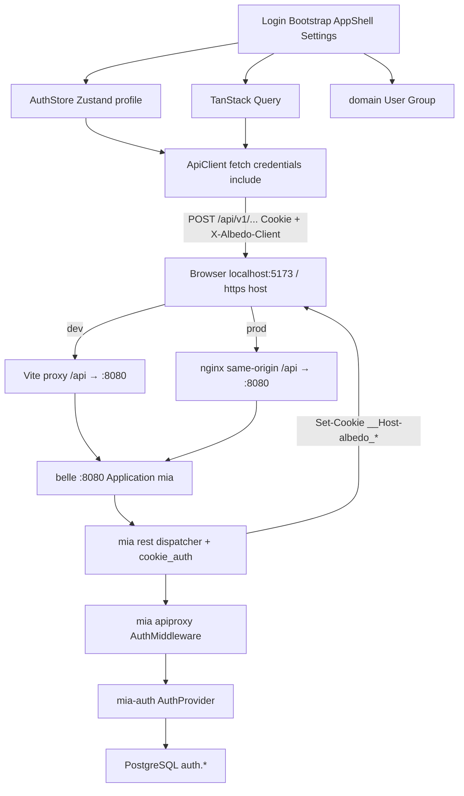

# Архитектура: albedo P0 (React SPA)

**Тип:** Clean Architecture (слои Presentation → Application → Domain → Infrastructure)  
**Стандарт:** `/home/opencode/projects/docs/CODING_STANDARD.md` v3.1 (§5 слои, §8 TypeScript, §10 безопасность, §11 тесты)  
**Контракт с бэком:** `docs/ADR-001-auth-contract.md` (accepted)  
**Логи:** `/home/opencode/projects/docs/LOGGING_STANDARD.md` v2.0 — никаких токенов, cookie, паролей в логах

Код приложения этим документом не пишется. Это карта для Соны.

---

## Контекст

- Репозиторий `/home/opencode/projects/albedo` — пустой git + план.
- Бэкенд: belle = обёртка mia. RPC `POST /api/v1/{module}/{function}` на `:8080`.
- Keycloak нет. REST CRUD нет. `custom_fields` не свалка профиля.
- Сессия SPA — HttpOnly cookies (`ADR-001`). Zustand **не** держит JWT.
- Dev same-origin через Vite proxy. Prod — nginx same-origin. CORS `*` не открывать.

Из памяти: local auth argon2id + JWT (belle/mia), CORS whitelist пуст по умолчанию, Token Family / reuse detection на refresh.

---

## Стек (версии — актуальный stable на Этапе 0, без альф)

| Слой | Выбор | Зачем |
|------|-------|--------|
| Сборка | **Vite** + `@vitejs/plugin-react` | SPA. SSR не нужен |
| UI | **React 19** + **TypeScript strict** | требование Мастера |
| Роутинг | **react-router** (data router) | `/login`, `/bootstrap`, `/` |
| Серверный стейт | **TanStack Query** | `get_me`, группы, retry |
| Клиентский стейт | **Zustand** | session flag + profile snapshot. Без Redux |
| HTTP | нативный **fetch** в `ApiClient` | envelope, cookies, без axios |
| Формы | **react-hook-form** + **zod** | login / profile на границе |
| Контролы | **bootstrap 5** (css; js только modal/tab) | `form-control`, `nav-tabs`, `list-group`, `modal` |
| Иконки | **bootstrap-icons** | |
| Тема | CSS variables + SCSS overrides | dark + violet gradients. Bootstrap не задаёт «вид сайта» |
| Тесты | **Vitest** + Testing Library + **MSW** (`TEMPORARY`) | |
| Линт | eslint + typescript-eslint + prettier | |

Отклонено: Next/Remix, Vue/Svelte, Redux, axios, Tailwind/MUI, Keycloak, CSS-in-JS, sessionStorage токенов, BFF.

---

## Компоненты

- **AppShell** — хром продукта: шапка, слот UserChip, заглушка workspace. Не bootstrap-navbar.
- **UserChip** — кликабельный объект профиля (ник/ФИО, email с ярким `@доменом`, аватар).
- **LoginPage / BootstrapPage** — публичные экраны. Бренд **Albedo**.
- **UserSettingsModal** — вкладки «Общая» + «Member Of».
- **ApiClient** — единственная точка HTTP: POST RPC, `credentials: 'include'`, `X-Albedo-Client: spa`, разбор envelope, refresh mutex.
- **AuthStore** — Zustand: `isAuthenticated`, `profile`, `settingsOpen`. Токенов нет.
- **AuthSession (domain)** — правила chipLabel / canRemove. Не знает React и fetch.
- **CookieSession (infrastructure)** — браузер сам хранит cookies; клиент только `credentials`. Нет `tokenStorage.ts`.

---

## Слои (CODING_STANDARD §5.1)

Зависимости только внутрь. Domain не импортирует React, bootstrap, fetch.

```
src/
  main.tsx
  app/                         # Presentation: провайдеры, router, AuthGuard
    App.tsx
    router.tsx
  theme/                       # Presentation: визуальный язык
    tokens.css
    bootstrap-overrides.scss
  features/                    # Presentation + тонкий Application glue
    login/       LoginPage.tsx  LoginForm.tsx
    bootstrap/   BootstrapPage.tsx
    shell/       AppShell.tsx   UserChip.tsx
    settings/    UserSettingsModal.tsx  GeneralTab.tsx  MemberOfTab.tsx
                 displayMutex.ts
  application/                 # Use cases
    session/
      startSession.ts          # needs_bootstrap → login/bootstrap → get_me
      refreshSession.ts        # POST auth.refresh_token, single-flight
      endSession.ts            # logout
    profile/
      loadMe.ts
      saveMe.ts
      changeUsername.ts
      uploadAvatar.ts
    groups/
      loadMyGroups.ts
      addMembership.ts
      removeMembership.ts
  domain/                      # Entities / VO / инварианты UI
    user.ts                    # User, DisplayName, chipLabel(), initials()
    group.ts                   # Group, canRemove(user, group)
    chipDisplayMode.ts         # "nickname" | "full_name"
    errors.ts                  # InvalidCredentials, Locked, Forbidden, …
  infrastructure/              # adapters
    api/
      envelope.ts
      client.ts                # ApiClient
      errors.ts                # envelope.error → domain errors
      authApi.ts
      types.ts                 # DTO = поля бэка
    logging/
      logger.ts                # без секретов
  shared/ui/
    Avatar.tsx
    Modal.tsx
  mocks/                       # TEMPORARY MSW после ADR
    handlers.ts
    browser.ts
```

Имена из домена: `User`, `Group`, `Profile`, `ChipDisplayMode`. Запрещены `Manager`, `Utils`, `Helper`, `DataProcessor`.

Branded types (§8): `UserId`, `GroupId`. Discriminated union для envelope result.

---

## Схема



---

## Связи

| От | К | Протокол |
|----|---|----------|
| Features | AuthStore | вызовы Zustand |
| Features | TanStack Query | hooks, ключи `["auth","me"]`, `["auth","groups"]` |
| AuthStore / Query | ApiClient | `call(module, fn, kwargs)` |
| ApiClient | origin `/api/v1/...` | HTTP POST JSON, `credentials: 'include'`, без Authorization |
| Vite / nginx | belle `:8080` | HTTP reverse-proxy, Cookie/Set-Cookie as-is |
| rest dispatcher | apiproxy | kwargs + access из cookie |
| AuthMiddleware | AuthProvider | validate access **или** refresh-cookie на refresh/logout |
| AuthProvider | PostgreSQL | SQL через Repository |

---

## Vite proxy (dev)

`vite.config.ts` (Сона, Этап 0.2; Рэй смотрит прокси, не CORS продукта):

- `server.proxy["/api"].target = "http://127.0.0.1:8080"`
- Проброс `Cookie` / `Set-Cookie` без `Domain`
- Не переписывать имена `__Host-albedo_at` / `__Host-albedo_rt`
- Браузер бьёт в `http://localhost:5173` → same-origin → CORS не нужен
- `credentials: 'include'` работает как first-party

Prod P0 образ не обязателен (план §11). Когда Рэй подключит nginx: `/` static, `/api` → 8080, TLS, без `Access-Control-Allow-Origin: *`.

---

## Тема

Не «сайт на бутстрапе». Bootstrap = контролы. Хром = свои токены.

| Токен | Роль | Ориентир |
|-------|------|----------|
| `--bg-base` | фон | `#0b0614` |
| `--bg-elevated` | shell, модалка | `#140a22` |
| `--bg-chip` | UserChip | полупрозрачный + blur |
| `--grad-violet` | primary, обводка chip | `#2e1064 → #6d28d9 → #a78bfa` |
| `--text-primary` | заголовки, ник | `#f5f3ff` |
| `--text-muted` | подписи | `#a89bbf` |
| `--email-domain` | `@домен` | `#c4b5fd` / `#e9d5ff` |
| `--danger` | ошибки | `#f87171` |
| `--radius-chip` | chip | аватар круг, chip `12px` |
| `--shadow-glow` | chip / primary | `0 0 24px rgba(109,40,217,.35)` |

Правила:

- Login: глубокий градиент, vignette, без стоковых паттернов.
- Кнопка «Войти»: градиент, не `.btn-primary`.
- `.form-control` / `.nav-tabs` / `.list-group-item` / `.modal-content` — перекрас через variables.
- Аватар без файла: инициалы на круге с градиентом.
- Нет светлого navbar, нет `.bg-dark` как «темы».
- Desktop-first ≥ 1100px. Mobile-polish не P0.

Порядок импорта: bootstrap css → `tokens.css` → `bootstrap-overrides.scss`.

---

## Карта экранов

```
старт
  ├─ GET-эквивалент: POST auth.needs_bootstrap
  │     true  → /bootstrap
  │     false → попытка POST auth.refresh_token (cookie)
  │                ok  → POST auth.get_me → /
  │                fail → /login
  └─ на / без сессии → /login
```

| Маршрут | Экран | Поведение |
|---------|-------|-----------|
| `/login` | LoginPage | бренд **Albedo**, username + password, ошибки из `envelope.error` |
| `/bootstrap` | BootstrapPage | только если `needs_bootstrap`; иначе redirect `/login`. После успеха **не** логинить молча → `/login` + подсказка |
| `/` | AppShell + UserChip | guard: нет сессии → `/login` |
| modal | UserSettingsModal | вкладки Общая \| Member Of |

### UserChip

- Слева: `chipLabel()` — `nickname` XOR `first_name + last_name` (`chip_display_mode`). Fallback username только если оба пусты.
- Под ним email: local обычным цветом, `@домен` — `--email-domain`.
- Справа: аватар (url или инициалы).
- Весь объект click → settings.

### Общая

Макет AD: аватар (upload в P0), ник + ручка, mutex «отображать», First+Last, email, телефон (не required), логин + смена с паролем, user_prompt (textarea + FileReader `.txt/.md` на клиенте, на сервер уходит текст).

### Member Of

Свои группы. list-group, Add из `list_groups`, Remove. UI `canRemove()` дублирует сервер (superadmin+Administrators, primary) и не заменяет его.

---

## Потоки данных

**Login**

1. `LoginForm` → zod → `authApi.login({username, password})`
2. POST `/api/v1/auth/login` + `X-Albedo-Client: spa` + `credentials`
3. 401/`INVALID_CREDENTIALS` → показать `error.message`, не «Request failed»
4. 200: Set-Cookie (браузер), `data` без токенов
5. `get_me` → AuthStore.profile → navigate `/`

**Refresh (истек access)**

1. ApiClient ловит 401 на не-public RPC
2. Mutex: один `POST auth.refresh_token` (тело `{}`, cookie rt)
3. Успех → retry исходного запроса
4. Провал / `REUSE_DETECTED` → `logout` + `/login`

**Avatar**

1. File → клиент режет по 256 KiB / MIME
2. `set_avatar` RPC (b64)
3. Chip: `` (GET, cookie) либо инициалы если `avatar_url == null`

**Logout**

1. POST `auth.logout` → сервер Max-Age=0 обеих cookie
2. Сброс Query cache + AuthStore → `/login`

---

## ApiClient (контракт класса)

- `call(module, function, kwargs): Promise<data>`
- URL: `/api/v1/${module}/${function}`
- Всегда `credentials: "include"`
- Всегда `X-Albedo-Client: spa` на POST
- **Нет** `Authorization`
- `error != null` → throw доменной ошибки при любом HTTP
- 401 → refresh single-flight → retry один раз
- Не логировать `password`, cookie, b64 аватара

Public (без сессии): `needs_bootstrap`, `bootstrap`, `login`.  
Cookie-credential (без живого access): `refresh_token`, `logout`.

---

## AuthStore

Не хранит access/refresh.

```
isAuthenticated: boolean
profile: Profile | null
settingsOpen: boolean
```

Гидрация: `startSession()` на старте приложения. Reload вкладки переживают cookies, не sessionStorage.

`chipLabel(profile)` в domain.

---

## MSW

Только после этого ADR. Хендлеры = RPC-пути, не REST CRUD. Включение: `import.meta.env.DEV && VITE_USE_MSW === "1"`. Комментарий `TEMPORARY`. Катерина не принимает тесты, зелёные только на MSW.

---

## Обоснование решений

- **Clean layers:** CODING_STANDARD §5. Domain тестируется без jsdom-fetch.
- **Cookies + Vite proxy:** ADR-001, OWASP JWT, BCP browser apps 2026. Same-origin дешевле и безопаснее CORS.
- **Zustand узкий:** три поля сессии, не нормализованный граф.
- **TanStack Query на профиль/группы:** серверный стейт, retry, инвалидация после `update_me`.
- **RHF+zod:** валидация на границе, не в JSX.
- **Bootstrap как контролы:** приказ Мастера; тема — свои tokens.
- **Нет tokenStorage:** XSS не читает HttpOnly. Отклонены sessionStorage и BFF.

---

## Тестируемость и расширение

| Компонент | Изоляция |
|-----------|----------|
| `chipLabel` / `canRemove` | unit без React |
| `displayMutex` | unit |
| `ApiClient` | MSW / fake fetch |
| LoginForm | Testing Library + zod errors |
| MemberOfTab | stub `canRemove` + disabled |

Новые экраны (чат, workspace) — `features/*` + Application use case. Domain/auth не раздувать. Админка чужих юзеров — не P0, отдельный permission `users:*`.

---

## Риски (фронт)

| Риск | Митигация |
|------|-----------|
| Контракт бэка не влит | Этапы 2–4 = вёрстка disabled, без фейкового профиля |
| Двойной refresh | mutex в ApiClient |
| Cookie не проксируется | Этап 0.2 + проверка Set-Cookie в DevTools на origin :5173 |
| MSW залипнет | флаг + один прогон против живого belle |
| Логи утекут | logger redacts password / cookie / authorization |

Лита ревьюит ADR-001 до Этапа 1. Рэй — только dev proxy.
